# osu_bot_framework-v3
The most accessible platform for creating, sharing and using osu multiplayer bots.

This software has been designed to be as accessible as possible, whether you are a Python developer, Javascript developer or just a normal user.


## This is a work in progress!
#### Windows
- Simply download the source code and execute launch.exe. Easy as cake!

#### Unix
- Install Python 3 with `apt install python3` or similar for your distro
- Install the required libraries with `python3 -m pip -r install requirements.txt`
- Execute launch.sh

### If you are just looking for an auto host rotate bot, you can download [simple-AHR](https://github.com/jramseygreen/osu_bot_framework-v3/releases/tag/ahr)

## Please! If you like this software consider donating to me so that I can continue to develop it. [Paypal](https://www.paypal.com/paypalme/joshuargreen)

Features
- Join and create game rooms
- Join any public channel
- Download, share and create logic profiles with ease (Python & Javascript supported!)
- Full webapp GUI with end-to-end AES256 CBC Encryption
- Full chat functionality
- Automatic beatmap download from Chimu.moe
- Search for beatmaps through Chimu.moe
- Command management system
- Message broadcasts on a timer in any channel
- Much more!

#### Credits
| Contributer | Osu profile                   | Github profile                   | contribution                                                                    |
|-------------|-------------------------------|----------------------------------|---------------------------------------------------------------------------------|
| qqzzy       | https://osu.ppy.sh/u/qqzzy    | https://github.com/jramseygreen/ | Project Creator, Coded entire project                                           |
| meowhal     | https://osu.ppy.sh/u/meowhal  | https://github.com/meowhal       | Smoothed logo, prototype webapp design, bug fixing, inspiration for the project |
| martin71    | https://osu.ppy.sh/u/martin71 | https://github.com/MerePebble    | logo design, initial design,extensive testing, help writing docs                                            |

# Getting started

##### How to download

Simply click on the green `code` button and choose `download ZIP`.
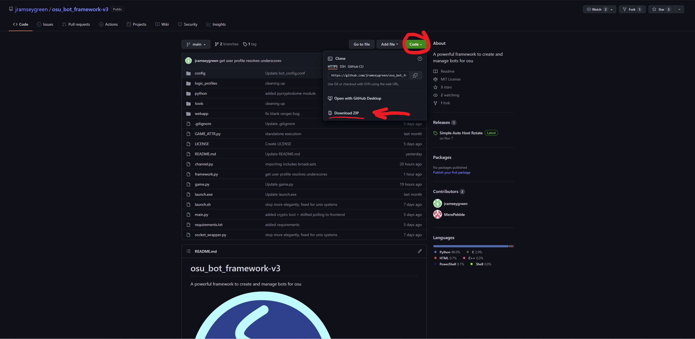

##### Obtaining login username and password
Go to [this](http://osu.ppy.sh/p/irc/) site to get your irc credentials for logging in to the bot framework. They are different from your regular login details

##### How to get the framework working

Once you have your username and password, open `launch.exe`

If all works correctly, it should look like this.: 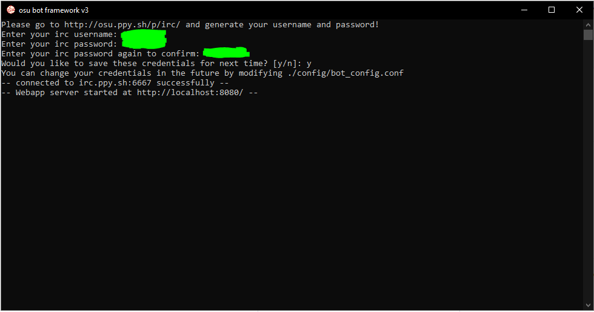

## Using the webapp

Copy the link the app gives you after successful login. (Visible on the picture above: Webapp server started at http://localhost:8080/ - you might have to use a different port number.) Next open any browser (E.g. Chrome/Internet Explorer...) and browse to it. You should be presented with the webapp interface below. 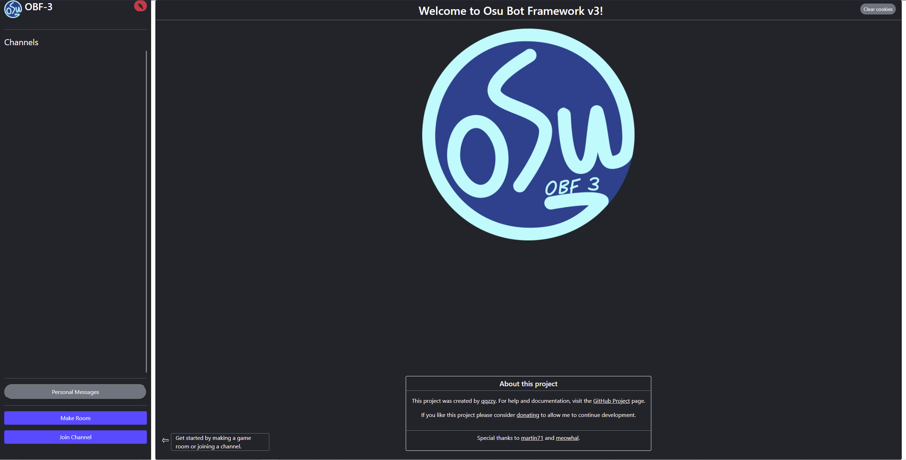
>If you are greeted with login page, the password is the same you used to log in in the command prompt.

If you want to get right into the action, click on the `make room` or `join channel` buttons.

#### Making a room

> For clarification: When you make a room, you create a real lobby in the osu! multiplayer where anyone can join. If you make too many of them bancho will not allow you to make more. Don't forget to close them via `Close room` button in the channel options, as it takes some time for them to close on their own after an inactivity period.


As you can see, there are lots of initial options on what kind of lobby to make.

1. ###### Title and password
    Those are pretty straightforward. Anything but special characters works.
2. ###### Game Mode
    Pick your desired game mode for the lobby. E.g.: If you go for the mania game mode - the osu will automatically convert all the beatmaps picked if they are not mania. Also, there is a ton of other features where the framework checks for the game mode.
3. ###### Team type & Score type
    Nothing fancy, these work the same way they do in normal osu! multiplayer.
4. ###### Beatmap ID
    Pick the first beatmap you want to display in the lobby. (Beatmap ID can be obtained like this:) 
5. ###### Logic profile
    You can choose your desired logic profile for the lobby. There are quite a few premade and you can find out more about them in the Logic profiles section. For now just know that logic profiles are what determines how the lobby works e.g. who gets the host, what are the conditions to get the host, what are the conditions to play a beatmap, how does picking a beatmap work and much more!
6. ###### Room size
    Number of available slots in the room.
7. ###### Invite players
    Sends an invite link to all the chosen players. Your name is in the list by default but you can easily add or remove other players. (Just don't forget to click the small blue + next to the username bar to actually add the player to the list.)

> Note: You don't have to fill anything to create a lobby, you can set everything afterwards in the lobby options. More on that in the Channel options section.

#### Joining a channel (or existing lobby)

After you type the name of the channel you simply join it. You can join the public channels like #osu etc. but you will have limited options for what you can do there since it is not an actual match lobby. (Works even without # ,e.g. `lobby` would connect you to the #lobby channel.)

The same goes for an existing game room, just get the match link and paste it in the test box.

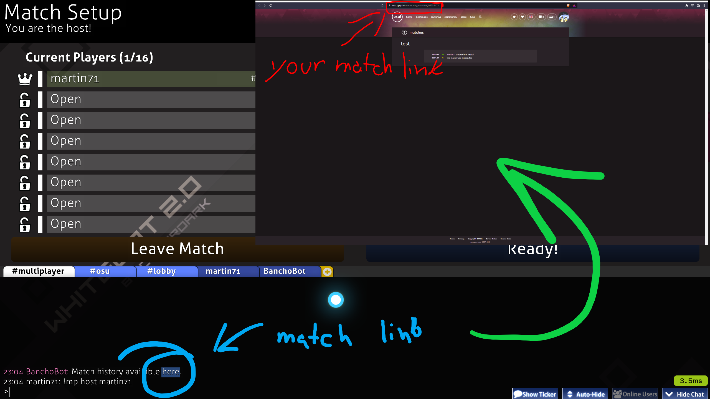 Remember that you can easily rejoin your own lobbies but if you join a lobby you did not create yourself or you are not a referee of the lobby nothing will work in the webapp because bancho won't give the webapp permissions to do anything.

#### Personal messages

They are connected to the game chat, meaning that you can chat with anyone without even opening the game! 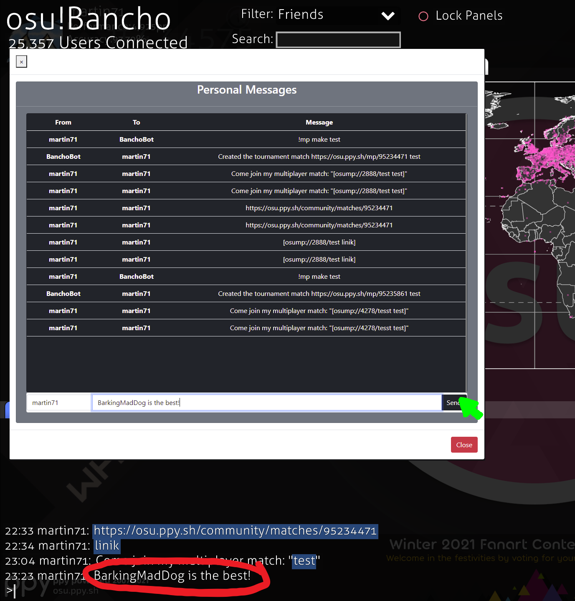

### Miscellaneous

Before we dive deeper into the functions of the lobbies, there are still some features in the webapp remaining outside of the lobbies.

1. #### Security
    By default the app runs in the localhost mode, meaning that only you from your device can open the webapp.

    If you run the app outside of just your device, authentication is advised. Authentication is a feature which encrypts the communication with the webapp using AES (Advanced Encryption Standard).

    - ###### How to use authentication

    To get the authentication working you head into the folder where you open the `launch.exe`, there open the `config` directory and you will find file called `bot_config.conf`. You can see some settings as well as your saved credentials in the file. But more importantly you are looking for `server_authentication": false,` If you change the `false` to `true` the webapp will demand a password for you to get inside the next time you restart the app. The password is the same one you use to open the app and if you saved it it's listed in the `bot_config.conf`.

    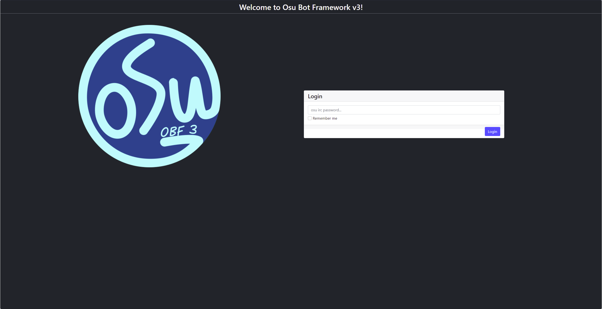

    > Note: You need to restart the app if you make any changes in the files for them to implement!

    - ###### Remember me

    To remember the password the webapp uses a **cookie**. The cookie lasts for exactly one day as long as you are using the same browser on the same device. 

    You can also manually wipe the cookie by pressing the `Clear cookies` button on the first page after logging in.

2. #### Logic profile manager
    
    A simple way of downloading and sharing logic profiles.

3. #### Global player blacklist
    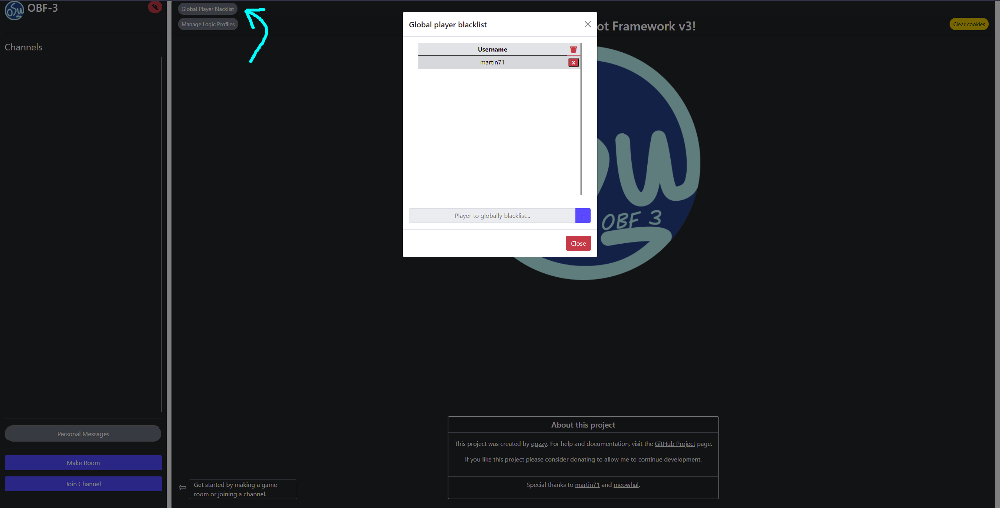

    More info on blacklists in the Blacklist (a player) section.

4. #### Shut down

    You can turn the app off with the `Shut down` button. It shuts down the app completely at the host device.
    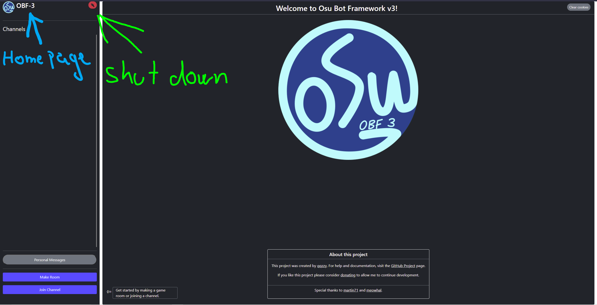
   
    > You can also shut down the program by typing `exit` in the command prompt
  


# Channel options

After you successfully create a lobby like this: 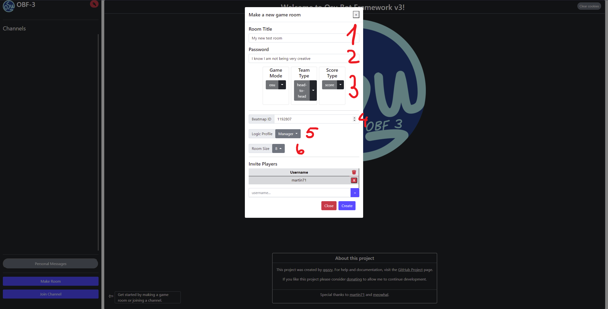

A new channel will pop up on the side. Click on the channel to see its options.

In the pictures the numbers correspond to where you can see/change each setting.

1. To edit the title, use the gray `Edit title` button in the right upper corner.
2. To edit password, use the blue `Edit password` button with number two assigned to it in the second picture.
3. There are multiple options ranging from difficulty settings to the type of maps allowed - check the beatmap
   checker section if you think they don't work.
4. Beatmap ID does not have a button assigned to it. If you want to use the beatmap of your choice, you can
   manually type command: `!mp map (e.g.)1192807 (0-3)` 0-osu!, 1-taiko, 2-catch the beat, 3-mania. Usually you specify gamemode only if you want to convert the beatmap.
5. Logic profile determines the way the bot behaves, more on them in Logic profiles section.
6. If you click on the little square with the number of present players you will see a simple window to change the number of free slots.

### Advanced options
  
1. ## `Beatmap checker`
  Beatmap checker automatically aborts all the matches if the beatmap conditions are not met. Not only does it abort but by default it prevents you from choosing beatmaps which are not fulfilling the conditions you set. (In rare cases it will allow you to choose a beatmap which doesn't meet the requirements. However, it will always abort.)

  **If you ever feel like something is not right and the lobby doesn't care about the conditions you set for the maps. Check if the beatmapchecker is on!**

2. #### `Allow Beatmap Conversion`
  Make the bot automatically convert beatmaps for the selected game mode.
  >For instance: In the webapp I select game mode mania. Now all the picked beatmaps are going to be automatically converted to mania. - Works only for game modes where osu! supports conversion.

3. #### `Allow unsubmitted beatmaps`
  Not only does it allow you to pick the unsubmitted beatmaps it also allows unsubmitted beatmaps to be picked by the `!randmap` command. Works basically the same way the `Map Status` options work located next to the `Mods` options.

4. #### `Maintain room tile` & `Maintain room password` & `Maintain room size`
  These three options save the settings and after every finished match they revert everything back to what was set with the last !mp comand.

5. #### `Start match automatically when all players are ready`
  Very self explanatory. If all the players pressed ready, match starts.

6. #### `Queue match to start when beatmap is selected (in seconds)`
  Match starts automatically after given time period.
  >Note: -1 = infinity; Any positive whole number will work.

7. #### `Welcome message`
  It is sent to whoever joins the lobby no matter how many times they join.

8. #### `Download beatmaps automatically from Chimu.moe`
  You don't need to click on the download button in osu lobby. You don't even need to have osu! running. All selected beatmaps get downloaded with the snap of fingers. By default they are saved to the freamwork files location.(They literally get saved next to the launch.exe)

9. #### `Download with video (if available)`
  The same as regular downloading with or without video.

10. #### `Open beatmaps automatically after downloading`
  After you download the beatmap it is opened no matter the file location. Since osu! automatically deletes extracted beatmaps, they get deleted wherever you chose the download location and they are saved as folders in your osu! songs directory, where all your beatmaps are.

11. #### `Redownload owned beatmaps`
  If you give the app your osu folder location. It will check for the beatmap set ID. If it confirms you have it. The download is not going to proceed.

12. #### Blacklists and Whitelists (for beatmaps)
  - Blacklist bans beatmap from being picked or found by the `!randmap` command.

  - Whitelist orders the framework to only allow beatmap picks included in the Whitelist or limits beatmaps found with the `!randmap` command.

### User options
  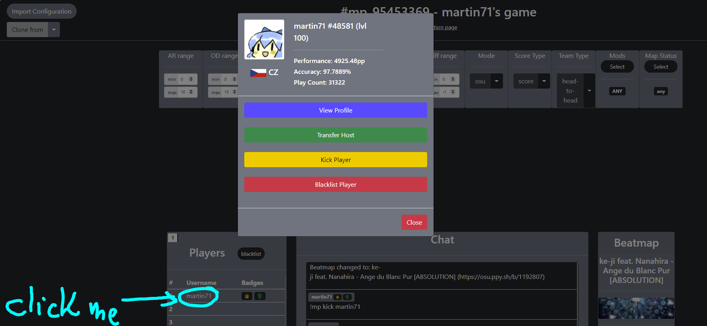
  By clicking on any player's name in the list of the players you will see a menu with simple and working options. (You can view someone's profile by clicking on his profile icon or his name as well.)

### Blacklist (a player)
  

  You can ban players from entering your lobby either lobby-wide or app-wide. In other words, the players you ban will not be able to join the concrete lobby or any lobby you created within the current session. Also, banning people who are present in the lobby will kick them automatically immediately.

  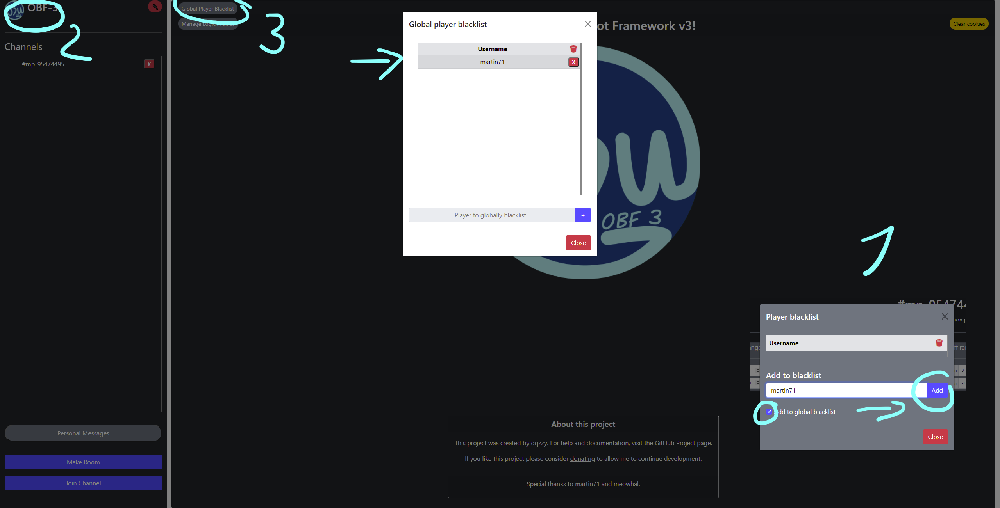

  To access the (app-wide) global blacklist you just head to the home page and press the `Global player blacklist` button.


### Config page
  On the top of the page right below the title of the room you can click the `view configuration page` link or write `!config` in the chat to get the link and a new configuration page will open with all the current settings.
     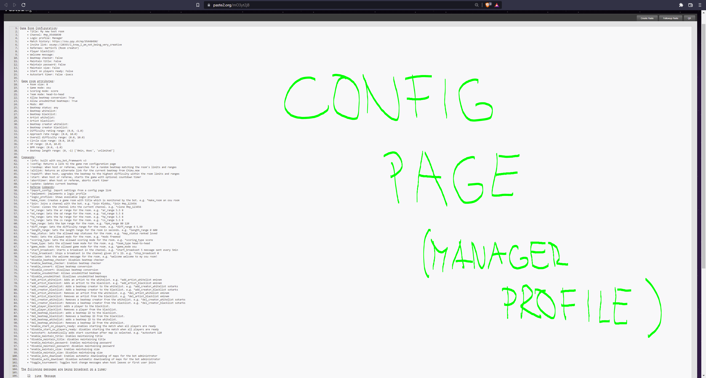
  The link is adaptable, meaning that every time you change any setting, it will get updated and produce a new config page with the current settings.

  - The page is divided in 3 big sections but basically just 2. The upper section is for the current settings and stats and the lower is for the available commands. (The number of available commands changes drastically depending on what logic profile you use.)

  - While the Config page is a useful overview of all the available options it is also great for copying the settings. You can create one lobby, set everything up and now if you want to send the same settings to your friend or save them for the next time you create a new lobby. All you need to do is to use the `Import configuration` button and you just copy the link of the config site to transfer the settings.  

  - The `Clone from` button works the same way but it's quicker and works only locally with the existing lobbies in the list.
  

### Broadcasts
  The `Broadcasts` button broadcasts infinitely the message you set until the bot leaves the lobby. Just set the period for the message and it will get resent every cycle. (Great caution recommended when it comes to the big channels like #osu and #lobby. If the moderators see your message pop up very often, you are likely to get chat banned for spam very quickly.)

  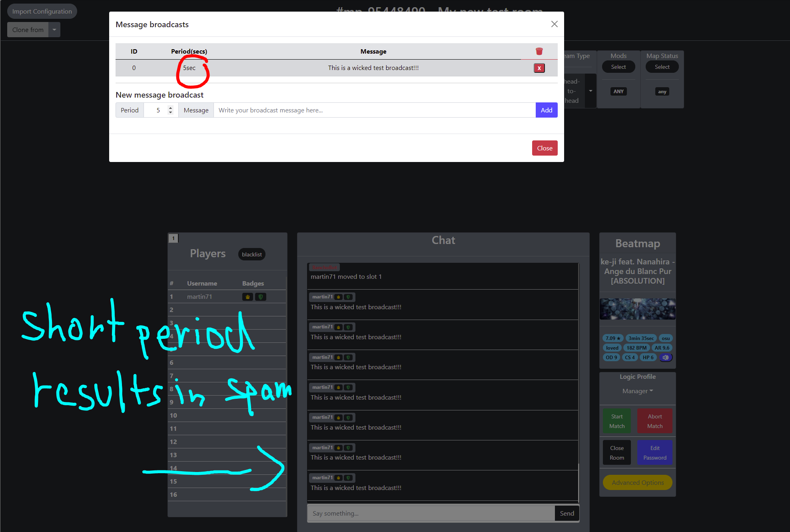

### Logic Profiles
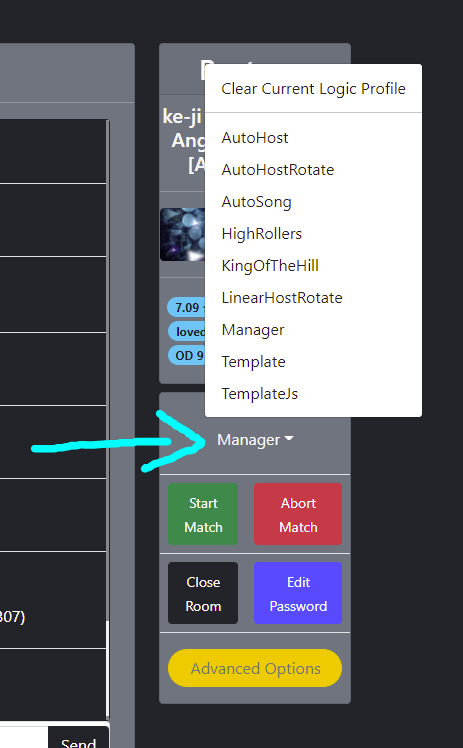

- Logic profiles are what gives the bot its structure. Each contains unique commands and works differently to suit the needs of the players.

- There are several premade logic profiles which show the possibilities of the framework. However, creating new logic profiles is highly encouraged as the default ones are meant to be more exemplary rather then widely used.

- Basically whatever you can think of is possible. There many possibilities from picking automatically maps on some set conditions to change the host based off a simple `!roll`. I recommend trying the premade out for yourself to see what they are capable of. More on how to create your logic profile later on. (The framework supports both java script and python!)

>For those who want to confirm the functions of default Logic profiles.:
- Autohost - The bot keeps the host and picks random maps within the set conditions.
- AutoHostRotate - Passes the host to the next player in the queue.
- Autosong - Keeps the host and randomly picks beatmaps matching the conditions after you finish a map and gives the next start countdown.
- HighRollers - Who `!roll`s  the highest number up to 100 wins the host.
- KingOfTheHill - Who wins, gets the host.
- LinerHostRotate - Host is passed always down to next player.
- Manager - Profile with all the commands for someone who wants to test things or have an interactive lobby.
- Template - Simple template useful to start with when creating your own logic profiles.
- TemplateJs - Same thing as the Tample but made with Java Script

## Config file (`bot_config.conf`)


This is an important file you might need to interact with at some point. It is located in the `config` folder. Here is a basic rundown.:

  - Lines 2 and 3 store the login information you used during your first login, that is if you used the option to save them of course. You can manually rewrite them here if you want to change them or you can just delete them to get prompted again the next time you open the app.

  - Lines 4 and 5 are to stay like that until peppy decides to change the bancho bot site or port.

  - Server authentication on line 6 simply enables/disables password when opening the webapp. (Change with true/false)

  - On line 7 you change the IP of the app, there are 4 main options:
    1. Using `localhost` you can open the webapp only from the device where you run the app.

    2. If you use your `IP address` you can use the network on your LAN. To find your IP address (on Windows) simply open `cmd` and write in `ipconfig` then look for either IPv4 or IPv6 address depending on what you're using. Then just write it in the browser on your other device connected to your LAN network e.g. wifi and you should see the webapp interface.
    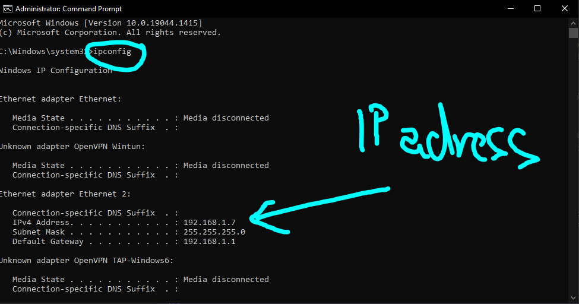

    3. Use `0.0.0.0` to make the webapp accessible on all available network interfaces in your enclosed LAN or in the Internet. (Recommended for people who want to use a server to run the app.)

    4. **Leaving the string blank "" will disable the webapp completely!**

  - Line 8 allows you to choose any available port for the webapp.

  - Line 9 is a for all those who would need to change the port which the frontend uses to communicate with the backend.

  - On line 10 you can change the number of messages visible in the chat box both in the frontend and the backend.

  - Lines 11 and 12 dictate the rate at which requests are send to the Bancho bot. The default settings of cap:"2" & period:"1" have been tested and are thought to be the best possible for a good reaction time while you don't get silenced by the bot for sending too many requests.

  - Line 13 is simply a question of whether you want to make log files in `./config/logs` folder.

  - Verbose is the option to make all the messages which would normally get sent to the log file be sent straight in the cmd interface of the app.

## Programatically managing osu
### The startup file
You can control what happens upon booting the framework with the `startup.py` file located in the `config` directory.
```python
# any code here will run on starting the framework
def startup(bot):
    bot.start()
    # Add below line
    # ---------------------------------------------
```

As we can see, this is where the bot instance actually starts and connects to the osu irc server, as well as starting up the webapp server.

Any code added to this method will be run, meaning you can invoke any method belonging to the Bot class. For example, you could programaticaly create a game room, implement a logic profile and change the allowed difficulty range:
```python
channel = bot.make_room(title="My room", logic_profile="Manager")
channel.set_diff_range((4, 5))
```
### Messages
Messages are dictionaries and have three components;
- The channel it belongs to
- The username of the account who sent it
- The message content
```
-> {"channel": "#osu", "username": "qqzzy": "content": "Hi guys"}
```
When sending or receiving a message, that message gets added to the message log.

---
- `bot.send_personal_message(username, message)`
  - sends a personal message to the username provided
  - all parameters are strings

- `bot.get_personal_message_log()`
  - returns the log of personal messages received as a list of dictionaries

- `channel.send_message(message)`
  - sends a message to the channel
  - message is a string

- `channel.get_message_log()`
  - returns the log of messages received in a channel as a list of dictionaries

### Dealing with channels and game rooms
You can join and part channels and game rooms in much the same way with a couple of differences.

- `bot.get_channels()`
  - returns a dictionary of all the channels and the corresponding channel objects

- `bot.get_channel(channel)`
  - returns a channel object related to the channel string whcih was provided

- `bot.join(channel)`
  - joins a channel with the framework - e.g. `#osu`, `#mp_123456`
    - a game room is joinable by either the channel ID or a match history url
  - returns a channel object

- `bot.part(channel)`
  - leaves a channel which is currently monitored by the framwork
    - parting a game room does not close it

- `bot.make_room(title, password, size, beatmapID, mods, game_mode, team_type, scoring_type, allow_convert, logic_profile, invite_list)`
  - creates a tournament room and joins it wirth the framework
  - all parameters are optional keyword parameters
    - title is a string denoting the title of the game room to create
      - defaults to "username's game"
    - password is a string containing the password to apply to the game room
      - blank by default
    - size is an integer denoting the number of available slots
      - defaults to 16
    - beatmapID is the fist beatmap to be selected when the room is created
      - beatmapID is an integer and defaults to the osu tutorial
    - mods is a list of mods to enforce
      - the list is comprised of strings and defaults to `["any"]`
    - game_mode is the game mode to lock the game room to
      - by default this is set to `"any"`
    - team_type is the team type to set the game room to
      - default is `"any"`
    - scoring_type is the scoring type to set the game room to
      - default is `"any"`
    - allow_convert is a boolean value denoting whether to allow beatmap conversion
      - default is `True`
    - logic_profile is a string denoting the logic profile to apply upon creation of the game room
      - defualt is to apply no logic profile
    - invite_list is a list of usernames to invite to the game room upon creation
      - the default invite list contains the username of the account running the bot
  - returns a channel object

- `channel.close()`
  - closes a game room
  - executes `on_close()` event method

### Managing logic profiles
You can implement logic profiles and even swap out logic on the fly programatically.
Logic profiles can be written in either Javascript or Python.

#### Bot methods
- `bot.refresh_logic_profiles()`
  - re-imports all logic profiles contained in the logic_profiles directory

- `bot.get_logic_profiles()`
  - returns a dictionary containing all the logic profiles which have been imported to the framework
    - the keys are strings pertaining to the names of the logic profiles' classes
    - the values are referances to the instantiable classes of the logic profiles
  - __Example__
    ```python
    # get a logic profile from the logic profiles dictionary
    Logic_Profile = bot.get_logic_profiles()["Manager"]

    # create an instance of the class
    manager_instance = Logic_Profile(bot, channel)

    # all the methods are accessible through this class
    # useful if you want to swap out logic between profiles
    manager_instance.on_join()
    ```
- `bot.get_logic_profile(profile)`
  - returns the instantiable class of the given profile parameter
  - profile is a string of the name of the class belonging to the desired logic profile

- `bot.implement_logic_profile(profile)`
  - implements a logic profile, but only implements the `on_personal_message()` event method
  - always active regardless of a channel
  - profile is a string of the name of the class you want to implement

- `bot.load_logic_profile(profile)`
  - loads a logic profile from the `logic_profiles` folder
  - profile is a string denoting the name of the logic profile
  - only works for Python logic profiles

- `bot.load_js_logic_profile(profile)`
  - loads a logic profile from the `logic_profiles` folder
  - profile is a string denoting the name of the logic profile
  - only works for Javascript logic profiles

#### Channel methods
- `channel.implement_logic_profile(profile)`
  - implements a logic profile by first instantiating it then binding the present overridable event methods to the channel
    - channels have `on_join()`, `on_part()`, `on_message()` and `on_personal_message()` available
    - game rooms have all event methods available
  - profile is a string of the name of the class you want to implement

- `channel.get_logic_profile()`
  - returns a string of the current logic profile class which is implemented

---
#### Swapping out logic / changing event methods
Individual event methods can be changed at any time. Simply invoke the `on_event_method()` of your choice with a new method or None to disable it.

__Example__
```python
# Replacement event method
def new_on_join_method(username):
    channel.send_message("on_join was replaced")

# make a game room  
channel = bot.make_room()

# implement a logic profile
channel.implement_logic_profile("AutoHostRotate")

# swap out the on_join logic
channel.on_join(new_on_join_method)
```
- `channel.get_logic()`
  - returns a dictionary of all the event methods of the channel

- `channel.clear_logic()`
  - removes all event methods currently employed

- `channel.clear_logic_profile()`
  - unloads a logic profile and any commands it set

---
#### Sharing logic profiles
Logic profiles can be easily shared and downloaded. This is achieved through the use of paste2.org as a secure intermediary.

- `bot.upload_logic_profile(profile)`
  - uploads a logic profile to paste2.org and returns the url of the page
  - profile is a string of the class name of the logic profile

- `bot.get_logic_profile_link(profile)`
  - returns the paste2.org link of the given profile
    - uploads the profile if a link does not already exist
  - profile is a string of the class name of the logic profile

- `bot.get_logic_profile_links()`
  - returns a dictionary of all the logic profiles and their respective links

- `bot.download_logic_profile(url)`
  - downloads a logic profile from the given paste2.org url
  - downloads to the logic_profiles directory


### Managing room attributes
You can analyse, import and clone all channel attributes including broadcasts and toggles.

- `bot.clone(channel1, channel2)`
  - clones all logic and attributes from channel1 to channel2
  - channel1 and channel2 are channel objects

- `channel.get_attrbiutes()`
  - returns a dictionary of all attrbutes of a channel

- `channel.import_attributes(attrbutes)`
  - imports attributes from a given dictionary of channel attributes
    - the required attributes parameter is identical to the dictionary returned from `channel.get_attributes()`


## Creating Logic Profiles
Logic profiles are designed to be self contained bots which can run logic independently in joined channels.
Logic profiles are contained in the `logic_profiles` directory and are automatically loaded when the framework is launched.

### Event method architecture
The basis of logic profiles are overridable event methods.
These methods are designed to run on individual threads and are only executed after any room attributes have been updated.

__Example - *Template.py*__

A logic profile will be named according to the file name and class name assigned to it (they must match).
In the initialiser, the current bot object and channel object will be passed as parameters.
```python
# logic profile named Template
class Template:
    # a logic profile must always take a bot object and a channel object as parameters
    def __init__(self, bot, channel):
        self.bot = bot
        self.channel = channel
```

__Example - *TemplateJs.js*__
A Javascript logic profile is named after its file name.
The constructor method is mandatory and has the bot and channel objects passed as parameters.

You can interact with everything in the same way as Python, only with Javascript syntax!
```javascript
LogicProfile = {
  constructor: function (bot, channel) {
    LogicProfile.bot = bot;
    LogicProfile.channel = channel;
  },
}
```

The available overridable event methods are listed below. Some methods have optional parameters which you can include if needed.
By including any of the methods in your logic profile, the code contained inside will be run when that event has occured.

__Python__
```python

# runs when a personal message is received
# message is a dictionary containing the username, channel and message
# channel parameter in message dictionary is the bot username
def on_personal_message(self, message):
    pass

# runs when a message is received in the channel
# message is a dictionary containing the username, channel and message
def on_message(self, message):
    pass

# runs when a user joins the channel
# slot is an integer of the slot number joined
# username is a string of the user's username who joined
def on_join(self, username, slot):
    pass

# runs when a user leaves the channel
# slot is an integer of the slot number joined
# username is a string of the user's username who joined
def on_part(self, username, slot):
    pass

# runs when the match is started
def on_match_start(self):
    pass

# runs when the match finishes normally
def on_match_finish(self):
    pass

# runs when a match is aborted with either a command or the method channel.abort_match()
def on_match_abort(self):
    pass

# runs when the host is changed
# old_host is the username of the user who had host before the change
# new_host is the username of the user who has just received host
def on_host_change(self, old_host, new_host):
    pass

# runs when a user changes team
# username is the username of the user who changed team
# team is the colour of the team joined
def on_team_change(self, username, team):
    pass

# runs when a user is added to a team
# username is the username of the user who changed team
# team is the colour of the team joined
def on_team_addition(self, username, team):
    pass

# runs when a user changes slot
# slot is an integer of the slot number joined
# username is a string of the user's username who joined
def on_slot_change(self, username, slot):
    pass

# runs when all players in the room have readied up
def on_all_players_ready(self):
    pass

# runs when the beatmap is changed
# old beatmap is the previous beatmap before the change
# new_beatmap is the beatmap which hasw just been changed to
def on_beatmap_change(self, old_beatmap, new_beatmap):
    pass

# runs when host enters map select
def on_changing_beatmap(self):
    pass

# runs when a game room is closed
def on_room_close(self):
    pass

# runs when the host is cleared
# old_host is the host prior to clearing the room
def on_clear_host(self, old_host):
    pass

# runs when an enforced attribute is violated
# error contains:
# type - the type of on_rule_violation
# message - a message to explain what is going on
def on_rule_violation(self, error):
    pass
```

__Javascript__
```javascript
// runs when a personal message is received
// message is a dictionary containing the username, channel and message
// channel parameter in message dictionary is the bot username
on_personal_message: function (message) {
    return;
},

// runs when a message is received in the channel
// message is a dictionary containing the username, channel and message
on_message: function (message) {
    return;
},
// runs when a user joins the channel
// slot is an integer of the slot number joined
// username is a string of the user's username who joined
on_join: function (username, slot) {
    return;
},

// runs when a user leaves the channel
// slot is an integer of the slot number joined
// username is a string of the user's username who joined
on_part: function (username, slot) {
    return;
},

// runs when the match is started
on_match_start: function () {
    return;
},

// runs when the match finishes normally
on_match_finish: function () {
    return;
},

// runs when a match is aborted with either a command or the method channel.abort_match()
on_match_abort: function () {
    return;
},

// runs when the host is changed
// old_host is the username of the user who had host before the change
// new_host is the username of the user who has just received host
on_host_change: function (old_host, new_host) {
    return;
},

// runs when a user changes team
// username is the username of the user who changed team
// team is the colour of the team joined
on_team_change: function (username, team) {
    return;
},

// runs when a user is added to a team
// username is the username of the user who changed team
// team is the colour of the team joined
on_team_addition: function (username, team) {
    return;
},

// runs when a user changes slot
// slot is an integer of the slot number joined
// username is a string of the user's username who joined
on_slot_change: function (username, slot) {
    return;
},

// runs when all players in the room have readied up
on_all_players_ready: function () {
    return;
},

// runs when the beatmap is changed
// old beatmap is the previous beatmap before the change
// new_beatmap is the beatmap which hasw just been changed to
on_beatmap_change: function (old_beatmap, new_beatmap) {
    return;
},

// runs when host enters map select
on_changing_beatmap: function () {
    return;
},

// runs when a game room is closed
on_room_close: function () {
    return;
},

// runs when the host is cleared
// old_host is the host prior to clearing the room
on_clear_host: function (old_host) {
    return;
},

// runs when an enforced attribute is violated
// error contains:
// type - the type of on_rule_violation
// message - a message to explain what is going on
on_rule_violation: function (error) {
    return;
}
```

### Commands
You can easily create commands inside of the initialiser / constructor function of your logic profile.

Use the `set_command()` method to add a command to the current channel.

__Example__
- Python
  ```python
  class Template:
      # a logic profile must always take a bot object and a channel object as parameters
      def __init__(self, bot, channel):
          self.bot = bot
          self.channel = channel

          channel.set_command("!simple_command", "Text to send as a response", "A description of the command")
          channel.set_command("!advanced_command", self.response_method, "A description of the command")

      def response_method(self, message):
          self.channel.send_message(message["username"] + " sent " + message["content"] + " in " + message["channel"])
  ```

- Javascript
  ```javascript
  LogicProfile = {
    constructor: function(bot, channel) {
        LogicProfile.bot = bot;
        LogicProfile.channel = channel;

        channel.set_command("!simple_command", "Text to send as a response", "A description of the command")
        channel.set_command("!advanced_command", LogicProfile.response_method, "A description of the command")
    },
    response_method: function (message) {
        LogicProfile.channel.send_message(message.username + " sent " + message.content + " in " + message.channel)
    }
  };
  ```
As we can see in the above example, a simple command can be set where some predefined text is provided as a response.
Alternatively, a custom method can be employed utilising the event method architecture to execute the method on a thread.

Using a custom method for a command means that you can receive a message as a parameter. Messages have three components;
- The channel it belongs to
- The username of the account who sent it
- The message content

---

Certain pre-made methods have been included for common use case commands, accessible through a channel object.

__Example__
```python
# command selecting a random map
channel.set_command("!randmap", channel.common_commands.randmap, "When host or referee, searches for a random beatmap matching the room's limits and ranges")
```

#### Available pre defined command methods
**Method**|**Description**
:-----:|:-----:
channel.common\_commands.config\_link|Returns a link to the game room configuration page
channel.common\_commands.randmap|When host or referee, searches for a random beatmap matching the room's limits and ranges
channel.common\_commands.altlink|Returns an alternate link for the current beatmap from Chimu.moe
channel.common\_commands.ar\_range|Sets the ar range for the room
channel.common\_commands.od\_range|Sets the od range for the room
channel.common\_commands.hp\_range|Sets the hp range for the room
channel.common\_commands.cs\_range|Sets the cs range for the room
channel.common\_commands.bpm\_range|Sets the bpm range for the room
channel.common\_commands.diff\_range|Sets the difficulty range for the room
channel.common\_commands.length\_range|Sets the length range for the room in seconds
channel.common\_commands.map\_status|Sets the allowed map statuses for the room
channel.common\_commands.mods|Sets the allowed mods for the room
channel.common\_commands.scoring\_type|Sets the allowed scoring mode for the room
channel.common\_commands.team\_type|Sets the allowed team mode for the room
channel.common\_commands.game\_mode|Sets the allowed game mode for the room
channel.common\_commands.welcome\_message|Sets the welcome message for the room
channel.common\_commands.add\_broadcast|Starts a broadcast in the channel
channel.common\_commands.del\_broadcast|Stops a broadcast in the channel given it's ID
channel.common\_commands.add\_beatmap\_blacklist|adds a beatmap ID to the blacklist
channel.common\_commands.del\_beatmap\_blacklist|Removes a beatmap ID from the blacklist
channel.common\_commands.add\_beatmap\_whitelist|adds a beatmap ID to the whitelist
channel.common\_commands.del\_beatmap\_whitelist|Removes a beatmap ID from the whitelist
channel.common\_commands.add\_beatmap\_creator\_blacklist|Adds a beatmap creator to the blacklist
channel.common\_commands.add\_beatmap\_creator\_whitelist|Adds a beatmap creator to the whitelist
channel.common\_commands.del\_beatmap\_creator\_whitelist|Removes a beatmap creator from the whitelist
channel.common\_commands.del\_beatmap\_creator\_blacklist|Removes a beatmap creator from the blacklist
channel.common\_commands.add\_artist\_whitelist|Adds an artist to the whitelist
channel.common\_commands.add\_artist\_blacklist|Adds an artist to the blacklist
channel.common\_commands.del\_artist\_whitelist|Removes an artist from the whitelist
channel.common\_commands.del\_artist\_blacklist|Removes an artist from the blacklist
channel.common\_commands.implement\_logic\_profile|Implements a logic profile
channel.common\_commands.get\_logic\_profiles|Shows available logic profiles
channel.common\_commands.enable\_beatmap\_checker|Enables beatmap checker
channel.common\_commands.disable\_beatmap\_checker|Disables beatmap checker
channel.common\_commands.start\_timer|When host or referee, starts the game with optional countdown timer
channel.common\_commands.abort\_start\_timer|When host or referee, aborts start timer
channel.common\_commands.enable\_start\_on\_players\_ready|enables starting the match when all players are ready
channel.common\_commands.disable\_start\_on\_players\_ready|disables starting the match when all players are ready
channel.common\_commands.set\_auto\_start\_timer|Automatically adds start countdown after map is selected
channel.common\_commands.add\_player\_blacklist|adds a player to the blacklist
channel.common\_commands.del\_player\_blacklist|Removes a player from the blacklist
channel.common\_commands.enable\_maintain\_title|Enables maintaining title
channel.common\_commands.disable\_maintain\_title|disables maintaining title
channel.common\_commands.enable\_maintain\_password|Enables maintaining password
channel.common\_commands.disable\_maintain\_password|disables maintaining password
channel.common\_commands.enable\_maintain\_size|Enables maintaining size
channel.common\_commands.disable\_maintain\_size|Disables maintaining size
channel.common\_commands.enable\_auto\_download|Enables automatic downloading of maps for the bot administrator
channel.common\_commands.disable\_auto\_download|Disables automatic downloading of maps for the bot administrator
channel.common\_commands.topdiff|When host, upgrades the beatmap to the highest difficulty within the room limits and ranges
channel.common\_commands.update\_beatmap|Updates current beatmap
channel.common\_commands.allow\_convert|Allows beatmap conversion
channel.common\_commands.disallow\_convert|Disallows beatmap conversion
channel.common\_commands.allow\_unsubmitted|Allows unsubmitted beatmaps
channel.common\_commands.disallow\_unsubmitted|Disallows unsubmitted beatmaps
channel.common\_commands.make\_room|Creates a game room with title which is managed by the bot
channel.common\_commands.join|Joins a channel with the bot
channel.common\_commands.clone|clones the channel into the current channel
channel.common\_commands.fight|Fight another user! Victories stack up

You can check if a command exists using `channel.has_command(command)` returning True where command is the string assigned to the given command.

- `channel.get_command(command)`
  - returns the response and description of a given command as a dictionary

- `channel.get_commands()`
  - returns a dictionary of all commands

## Useful methods
### Things to note

- When developing a logic profile, virtually every aspect of a game room / channel has been abstracted into easy methods.
- Usernames associated with messages are not identical to those in the user list.
  Message usernames have all spaces replaced by underscores (_). Certain methods e.g. channel.get_formatted_users() will return 'formatted' strings (spaces replaced with underscores).
- Methods checking aspects about usernames will work regardless of whether the username parameter is formatted or not, e.g. channel.is_host() or channel.is_referee()
- Game rooms inherit from Channels, all methods available to a Channel is also available to a Game room.

### User methods
#### Bot methods
- `bot.fetch_user_profile(username)`
  - Fetches information from the user profile returned as a dictionary
  - __Example__
  - ```
    bot.fetch_user_profile("qqzzy")

    ->> {"avatar_url":"https:\/\/a.ppy.sh\/10911588?1637935165.gif","country_code":"GB","default_group":"default","id":10911588,"is_active":true,"is_bot":false,"is_deleted":false,"is_online":true,"is_supporter":false,"last_visit":"2021-12-14T13:49:27+00:00","pm_friends_only":false,"profile_colour":null,"username":"qqzzy","cover_url":"https:\/\/osu.ppy.sh\/images\/headers\/profile-covers\/c3.jpg","discord":null,"has_supported":true,"interests":null,"join_date":"2017-09-27T15:49:08+00:00","kudosu":{"total":0,"available":0},"location":"United Kingdom","max_blocks":50,"max_friends":250,"occupation":null,"playmode":"osu","playstyle":null,"post_count":2,"profile_order":["me","recent_activity","top_ranks","medals","historical","beatmaps","kudosu"],"title":null,"title_url":null,"twitter":null,"website":null,"country":{"code":"GB","name":"United Kingdom"},"cover":{"custom_url":null,"url":"https:\/\/osu.ppy.sh\/images\/headers\/profile-covers\/c3.jpg","id":"3"},"is_admin":false,"is_bng":false,"is_full_bn":false,"is_gmt":false,"is_limited_bn":false,"is_moderator":false,"is_nat":false,"is_restricted":false,"is_silenced":false,"account_history":[{"description":"spamming in #osu","id":10349025,"length":1200,"timestamp":"2021-12-05T04:09:53+00:00","type":"silence"},{"description":"spamming in #lobby","id":10309070,"length":600,"timestamp":"2021-11-28T21:02:43+00:00","type":"silence"},{"description":"spamming in #lobby","id":10306375,"length":300,"timestamp":"2021-11-28T13:35:32+00:00","type":"silence"}],"active_tournament_banner":null,"badges":[],"beatmap_playcounts_count":4792,"comments_count":1,"favourite_beatmapset_count":10,"follower_count":141,"graveyard_beatmapset_count":2,"groups":[],"loved_beatmapset_count":0,"mapping_follower_count":0,"monthly_playcounts":[{"start_date":"2017-09-01","count":6},{"start_date":"2017-10-01","count":27},{"start_date":"2018-01-01","count":160},{"start_date":"2018-02-01","count":4},{"start_date":"2018-04-01","count":20},{"start_date":"2018-06-01","count":13},{"start_date":"2018-10-01","count":23},{"start_date":"2018-11-01","count":92},{"start_date":"2018-12-01","count":19},{"start_date":"2019-05-01","count":157},{"start_date":"2019-06-01","count":90},{"start_date":"2019-09-01","count":954},{"start_date":"2019-10-01","count":714},{"start_date":"2019-11-01","count":367},{"start_date":"2019-12-01","count":5},{"start_date":"2020-01-01","count":150},{"start_date":"2020-02-01","count":570},{"start_date":"2020-03-01","count":237},{"start_date":"2020-04-01","count":643},{"start_date":"2020-05-01","count":271},{"start_date":"2020-06-01","count":1155},{"start_date":"2020-07-01","count":1183},{"start_date":"2020-08-01","count":973},{"start_date":"2020-09-01","count":155},{"start_date":"2020-10-01","count":658},{"start_date":"2020-11-01","count":442},{"start_date":"2020-12-01","count":301},{"start_date":"2021-01-01","count":59},{"start_date":"2021-02-01","count":687},{"start_date":"2021-03-01","count":669},{"start_date":"2021-04-01","count":430},{"start_date":"2021-05-01","count":510},{"start_date":"2021-06-01","count":28},{"start_date":"2021-07-01","count":450},{"start_date":"2021-08-01","count":747},{"start_date":"2021-09-01","count":188},{"start_date":"2021-10-01","count":364},{"start_date":"2021-11-01","count":788},{"start_date":"2021-12-01","count":327}],"page":{"html":"<div class='bbcode bbcode--profile-page'>+-----------------------------------------------------------------------------------------------------------------------------+<br \/>|\u2000\u029c\u1d18\u2000\u2764\u2560\u0337\u2550\u0337\u2550\u0337\u2550\u0337\u2550\u0337\u2550\u0337\u2550\u0337\u2550\u0337\u2550\u0337\u2550\u0337\u2550\u0337\u2550\u0337\u2550\u0337\u2550\u0337\u2550\u0337\u2550\u0337\u2550\u0337\u2550\u0337\u2550\u29c3\u2550\u2563\u2000\u2000\u2000\u2000\u2000\u2591\u30109\u3011\u30109\u3011\u30109\u3011\u30109\u3011\u30109\u3011\u30109\u3011\u30109\u3011\u30109\u3011\u2591\u2000\u2000\u2000\u2000\u2000\u2000\u2000\u0455\u0455\u2000\u251c\u2000<span class=\"size-150\">\u25f4<\/span>\u2000\u2081\u2080\u2080.\u2080\u2080\ufe6a\u2000\u2524\u2000|<br \/>|\u2000\u2000\u2000\u2000\u2000\u2000\u2000\u2000\u2000\u2000\u2000\u2000\u2000\u2000\u2000\u2000\u2000\u2000\u2000\u2000\u2000\u2000\u2000\u2000\u2000\u2000\u2000\u2000\u2000\u2000\u2000\u2000\u2000\u2000\u2000\u2000\u2000\u2000\u2000\u2000\u2000\u2000\u2000SPECTATOR MODE - Watching qqzzy play [Galaxy Collapse] \u2000\u2000\u2000\u2000\u2000\u2000\u2000\u2000\u2000\u2000\u2000|<br \/>|\u2000\u2000\u2000\u2000\u2000\u2000\u2000\u2000\u2000\u2000\u2000\u2000\u2000\u2000\u2000\u2000\u2000\u2000\u2000\u2000\u2000\u2000\u2000\u2000\u2000\u2000\u2000\u2000\u2000\u2000\u2000\u2000\u2000\u2000\u2000\u2000\u2000\u2000\u2000\u2000\u2000\u2000\u2000\u2000\u2000\u2000\u2000\u2000\u2000\u2000\u2000\u2000\u2000\u2000\u2000\u2000\u2000\u2000\u2000\u2000\u2000\u2000\u2000\u2000\u2000\u2000\u2000\u2000\u2000\u2000\u2000\u2000\u2000\u2000\u2000\u2000\u2000\u2000\u2000\u2000\u2000\u2000\u2000\u2000\u2000\u2000\u2000\u2000\u2000\u2000\u2000\u2000\u2000\u2000\u2000\u2000\u2000\u2000\u2000\u2000\u2000\u2000\u2000\u2000\u2000\u2000 |<br \/>|\u2000\u2000\u2000\u2000\u2000\u2000\u2000\u2000\u2000\u2000\u2000\u2000\u2000\u2000\u2000\u2000\u2000\u2000\u2000\u2000\u2000\u2000\u2000\u2000\u2000\u2000\u2000\u2000\u2000\u2000\u2000\u2000\u2000\u2000\u2000\u2000\u2000\u2000\u2000\u2000\u2000\u2000\u2000\u2000\u2000\u2000\u2000\u2000\u2000\u2000\u2000\u2000\u2000\u2000\u2000\u2000\u2000\u2000\u2000\u2000\u2000\u2000\u2000\u2000\u2000\u2000\u2000\u2000\u2000\u2000\u2000\u2000\u2000\u2000\u2000\u2000\u2000\u2000\u2000\u2000\u2000\u2000\u2000\u2000\u2000\u2000\u2000\u2000\u2000\u2000\u2000\u2000\u2000\u2000\u2000\u2000\u2000\u2000\u2000\u2000\u2000\u2000\u2000\u2000\u2000\u2000 |<br \/>|\u2000\u2000\u2000\u2000\u2000\u2000\u2000\u2000\u2000\u2000\u2000\u2000\u2000\u2000\u2000\u2000\u2000\u2000\u2000\u2000\u2000\u2000\u2000\u2000\u2000\u2000\u2000\u2000\u2000\u2000\u2000\u2000\u2000\u2000\u2000\u2000\u2000\u2000\u2000\u2000\u2000\u2000\u2000\u2000\u2000\u2000\u2000\u2000\u2000\u2000\u2000\u2000\u2000\u2000\u2000\u2000\u2000\u2000\u2000\u2000\u2000\u2000\u2000\u2000\u2000\u2000\u2000\u2000\u2000\u2000\u2000\u2000\u2000\u2000\u2000\u2000\u2000\u2000\u2000\u2000\u2000\u2000\u2000\u2000\u2000\u2000\u2000\u2000\u2000\u2000\u2000\u2000\u2000\u2000\u2000\u2000\u2000\u2000\u2000\u2000\u2000\u2000\u2000\u2000___|<br \/>|\u2000\u2000\u2000\u2000\u2000\u2000\u2000\u2000\u2000\u2000\u2000\u2000\u2000\u2000\u2000\u2000\u2000\u2000\u2000\u2000\u2000\u2000\u2000\u2000\u2000\u2000\u2000\u2000\u2000\u2000\u2000\u2000\u2000\u2000\u2000\u2000\u2000\u2000\u2000\u2000\u2000\u2000\u2000\u2000\u2000\u2000\u2000\u2000\u2000\u2000\u2000\u2000\u2000\u2000\u2000\u2000\u2000\u2000\u2000\u2000\u2000\u2000\u2000\u2000\u2000\u2000\u2000\u2000\u2000\u2000\u2000\u2000\u2000\u2000\u2000\u2000\u2000\u2000\u2000\u2000\u2000\u2000\u2000\u2000\u2000\u2000\u2000\u2000\u2000\u2000\u2000\u2000\u2000\u2000\u2000\u2000\u2000\u2000\u2000\u2000\u2000\u2000\u2000 |K1 |<br \/>|\u2000\u2000\u2000\u2000\u2000\u2000\u2000\u2000\u2000\u2000\u2000\u2000\u2000\u2000\u2000\u2000\u2000\u2000\u2000\u2000\u2000\u2000\u2000\u2000\u2000\u2000\u2000\u2000\u2000\u2000\u2000\u2000\u2000\u2000\u2000\u2000\u2000<span class=\"size-150\">\u2460 \u2500\u2500\u2500 \u2461 \u2500\u2500\u2500 \u2462 \u2500\u2500\u2500 \u2463<\/span>\u2000\u2000\u2000\u2000\u2000\u2000\u2000\u2000\u2000\u2000\u2000\u2000\u2000\u2000\u2000\u2000\u2000\u2000\u2000\u2000\u2000\u2000\u2000\u2000\u2000 \u2000\u2000\u2000 |K2 |<br \/>|\u2000\u2000\u2000\u2000\u2000\u2000\u2000\u2000\u2000\u2000\u2000\u2000\u2000\u2000\u2000\u2000\u2000\u2000\u2000\u2000\u2000\u2000\u2000\u2000\u2000\u2000\u2000\u2000\u2000\u2000\u2000\u2000\u2000\u2000\u2000\u2000\u2000\u2000\u2000\u2000\u2000\u2000\u2000\u2000\u2000\u2000\u2000\u2000\u2000\u2000\u2000\u2000\u2000\u2000\u2000\u2000\u2000\u2000\u2000\u2000\u2000\u2000\u2000\u2000\u2000\u2000\u2000\u2000\u2000\u2000\u2000\u2000\u2000\u2000\u2000\u2000\u2000\u2000\u2000\u2000\u2000\u2000\u2000\u2000\u2000\u2000\u2000\u2000\u2000\u2000\u2000\u2000\u2000\u2000\u2000\u2000\u2000\u2000\u2000\u2000\u2000\u2000\u2000\u2000|M1| |\u2000\u2000\u2000\u2000\u2000\u2000\u2000\u2000\u2000\u2000\u2000\u2000\u2000\u2000\u2000\u2000\u2000\u2000\u2000\u2000\u2000\u2000\u2000\u2000\u2000\u2000\u2000\u2000\u2000\u2000\u2000 \u26aa\u2000\u2000\u2000\u2000\u2000\u2000\u2000\u2000\u2000\u2000\u2000\u2000\u2000\u2000\u2000\u2000\u2000\u2000\u2000\u2000\u2000\u2000\u2000\u2000\u2000\u2000\u2000\u2000\u2000\u2000\u2000\u2000\u2000\u2000\u2000\u2000\u2000\u2000\u2000\u2000\u2000\u2000\u2000\u2000\u2000\u2000\u2000\u2000\u2000\u2000\u2000\u2000\u2000\u2000\u2000\u2000\u2000\u2000\u2000\u2000\u2000\u2000\u2000\u2000\u2000\u2000\u2000\u2000\u2000\u2000|M2|<br \/>|\u2000\u2000\u2000\u2000\u2000\u2000\u2000\u2000\u2000\u2000\u2000\u2000\u2000\u2000\u2000\u2000\u2000\u2000\u2000\u2000\u2000\u2000\u2000\u2000\u2000\u2000\u2000\u2000\u2000 \u27cb\u2000\u2000\u2000\u2000\u2000\u2000\u2000\u2000\u2000\u2000\u2000\u2000\u2000\u2000\u2000\u2000\u2000\u2000\u2000\u2000\u2000\u2000\u2000\u2000\u2000\u2000\u2000\u2000\u2000\u2000\u2000\u2000\u2000\u2000\u2000\u2000\u2000\u2000\u2000\u2000\u2000\u2000\u2000\u2000\u2000\u2000\u2000\u2000\u2000\u2000\u2000\u2000\u2000\u2000\u2000\u2000\u2000\u2000\u2000\u2000\u2000\u2000\u2000\u2000\u2000\u2000\u2000\u2000\u2000\u2000\u2000\u2000\u2000\u2000 \u0305 \u0305\u2000\u0305 \u0305|<br \/>|\u2000\u2000\u2000\u2000\u2000\u2000\u2000\u2000\u2000\u2000\u2000\u2000\u2000\u2000<span class=\"size-150\">300<\/span>\u2000\u2000\u2000\u2000\u2000\u2000\u2000\u27cb\u2000\u2000\u2000\u2000\u2000\u2000\u2000\u2000\u2000\u2000\u2000\u2083\u2080\u2080\u2000\u2000\u2000\u2000\u2000\u2000\u2000\u2000\u2000\u2000\u2000\u2000\u2000\u2000\u2000\u2000\u2000\u2000\u2000\u2000\u2000\u2000\u2000\u2000\u2000\u2000\u2000\u2000\u2000\u2000\u2000\u2000\u2000\u2000\u2000\u2000\u2000\u2000\u2000\u2000\u2000\u2000\u2000\u2000\u2000\u2000\u2000\u2000\u2000\u2000\u2000\u2000\u2000\u2000\u2000\u2000\u2000\u2000\u2000\u2000\u2000\u2000\u2000\u2000\u2000\u2000|<br \/>|\u2000\u2000\u2000\u2000\u2000\u2000\u2000\u2000\u2000\u2000\u2000\u2000\u2000\u2000\u2000\u2000\u2000\u2000\u2000\u2000\u2000\u2000<span class=\"size-150\">\u2b55\u0489<\/span>\u2000\u2500\u2000\u2500\u2000\u2500\u2000\u2500\u2000<span class=\"size-85\">\u2b55\u0489<\/span>\u2000\u2000\u2000\u2000\u2000\u2000\u2000\u2000\u2000\u2000\u2000\u2000\u2000\u2000\u2000\u2000\u2000\u2000\u2000\u2000\u2000\u2000\u2000\u2000\u2000\u2000\u2000\u2000\u2000\u2000\u2000\u2000\u2000\u2000\u2000\u2000\u2000\u2000\u2000\u2000\u2000\u2000\u2000\u2000\u2000\u2000\u2000\u2000\u2000\u2000\u2000\u2000\u2000\u2000\u2000\u2000\u2000\u2000\u2000\u30104\u0305\u03328\u0305\u03320\u0305\u0332f\u0305\u0332p\u0305\u0332s\u0305\u0332\u3011|<br \/>|\u2000\u2000\u2000\u2000\u2000\u2000\u2000\u2000\u2000\u2000\u2000\u2000\u2000\u2000\u2000\u2000\u2000\u2000\u2000\u2000\u2000\u2000\u2000\u2000\u2000\u2000\u2000\u2000\u2000\u2000\u2000\u2000\u2000\u2000\u2000\u2000\u2000\u2000\u2000\u2000\u2000\u2000\u2000\u2000\u2000\u2000\u2000\u2000\u2000\u2000\u2000\u2000\u2000\u2000\u2000\u2000\u2000\u2000\u2000\u2000\u2000\u2000\u2000\u2000\u2000\u2000\u2000\u2000\u2000\u2000\u2000\u2000\u2000\u2000\u2000\u2000\u2000\u2000\u2000\u2000\u2000\u2000\u2000\u2000\u2000\u2000\u2000\u2000\u2000\u2000\u2000\u2000\u2000\u2000\u2000\u2000\u2000\u2000\u2000\u30101\u0305\u0332m\u0305\u0332s\u0305\u0332\u3011\u2000|<br \/>|\u2000\u2000\u2000\u2000\u2000\u2000\u2000\u2000\u2000\u2000\u2000\u2000\u2000\u2000\u2000\u2000\u2000\u2000\u2000\u2000\u2000\u2000\u2000\u2000\u2000\u2000\u2000\u2000\u2000\u2000\u2000\u2000\u2000\u2000\u2000\u2000\u2000\u2000\u2000\u2000\u2000\u2000\u2000\u2000\u2000\u2000\u2000\u2000\u2000\u2000\u2000\u2000\u2000\u2000\u2000\u2000\u2304\u2000\u2000\u2000\u2000\u2000\u2000\u2000\u2000\u2000\u2000\u2000\u2000\u2000\u2000\u2000\u2000\u2000\u2000\u2000\u250c\u2500\u2500\u2500\u2500\u2500\u2500\u2500\u2500\u2500\u2500\u2500\u252c\u2500\u2500\u2500\u2500\u2500\u2500\u2500\u2500\u2500\u2510\u2000 |<br \/>|\uff43\uff4f\uff4d\uff42\uff4f\u2000\u2468\u2468\u2468\u2468\uff38 \u2000\u2000\u2000\u2000\u2000\u2000\u2000\u2000\u2000\u2000\u2000\u2000\u2000\u2000\u2000\u2000\u2000\u2000\u2000\u2000\u2000\u2000\u2000\u2000\u2000\u2000\u2000\u2500\u2500 \u2500\u2500 \u2534 \u2500\u2500 \u2500\u2500\u2000\u2000\u2000\u2000\u2000\u2000\u2000\u2000\u2000\u2000\u2000\u2000\u2000|\ud83d\udc6a Online Users\u2000|\u25b2 Show Chat |\u2000\u2000|<br \/>+------------------------------------------------------------------------------------------------------------------------------+<br \/><br \/><h2>Need an Osu! bot?<\/h2><div class=\"js-spoilerbox bbcode-spoilerbox\"><button class=\"js-spoilerbox__link bbcode-spoilerbox__link\" type=\"button\"><span class=\"bbcode-spoilerbox__link-icon\"><\/span><\/button><div class=\"bbcode-spoilerbox__body\">Check out <a rel=\"nofollow\" href=\"https:\/\/github.com\/jramseygreen\/Simple-Osu-Bot-Framework\">https:\/\/github.com\/jramseygreen\/Simple-Osu-Bot-Framework<\/a> to easily make an irc bot for osu in Python.<\/div><\/div><br \/>I do freelance fullstack development.<br \/><br \/>Get in contact if you are looking for a software developer or website creator.<br \/><br \/>[url]<span class=\"proportional-container js-gallery\" style=\"width:162px;\" data-width=\"162\" data-height=\"65\" data-index=\"0\" data-gallery-id=\"741039070\" data-src=\"https:\/\/i.ppy.sh\/397f4eea27204f5bbfd9f4a7b8a27a226d32c4c5\/68747470733a2f2f7331312e666c6167636f756e7465722e636f6d2f636f756e74322f4c61664d2f62675f4646464646462f7478745f3030303030302f626f726465725f4343434343432f636f6c756d6e735f322f6d6178666c6167735f31302f766965776572735f302f6c6162656c735f302f7061676576696577735f302f666c6167735f302f70657263656e745f302f\"><span class=\"proportional-container__height\" style=\"padding-bottom:40.123456790123%;\"><\/span><\/span>[\/url]<\/div>","raw":"+-----------------------------------------------------------------------------------------------------------------------------+\n|\u2000\u029c\u1d18\u2000\u2764\u2560\u0337\u2550\u0337\u2550\u0337\u2550\u0337\u2550\u0337\u2550\u0337\u2550\u0337\u2550\u0337\u2550\u0337\u2550\u0337\u2550\u0337\u2550\u0337\u2550\u0337\u2550\u0337\u2550\u0337\u2550\u0337\u2550\u0337\u2550\u0337\u2550\u29c3\u2550\u2563\u2000\u2000\u2000\u2000\u2000\u2591\u30109\u3011\u30109\u3011\u30109\u3011\u30109\u3011\u30109\u3011\u30109\u3011\u30109\u3011\u30109\u3011\u2591\u2000\u2000\u2000\u2000\u2000\u2000\u2000\u0455\u0455\u2000\u251c\u2000[size=150]\u25f4[\/size]\u2000\u2081\u2080\u2080.\u2080\u2080\ufe6a\u2000\u2524\u2000|\n|\u2000\u2000\u2000\u2000\u2000\u2000\u2000\u2000\u2000\u2000\u2000\u2000\u2000\u2000\u2000\u2000\u2000\u2000\u2000\u2000\u2000\u2000\u2000\u2000\u2000\u2000\u2000\u2000\u2000\u2000\u2000\u2000\u2000\u2000\u2000\u2000\u2000\u2000\u2000\u2000\u2000\u2000\u2000SPECTATOR MODE - Watching qqzzy play [Galaxy Collapse] \u2000\u2000\u2000\u2000\u2000\u2000\u2000\u2000\u2000\u2000\u2000|\n|\u2000\u2000\u2000\u2000\u2000\u2000\u2000\u2000\u2000\u2000\u2000\u2000\u2000\u2000\u2000\u2000\u2000\u2000\u2000\u2000\u2000\u2000\u2000\u2000\u2000\u2000\u2000\u2000\u2000\u2000\u2000\u2000\u2000\u2000\u2000\u2000\u2000\u2000\u2000\u2000\u2000\u2000\u2000\u2000\u2000\u2000\u2000\u2000\u2000\u2000\u2000\u2000\u2000\u2000\u2000\u2000\u2000\u2000\u2000\u2000\u2000\u2000\u2000\u2000\u2000\u2000\u2000\u2000\u2000\u2000\u2000\u2000\u2000\u2000\u2000\u2000\u2000\u2000\u2000\u2000\u2000\u2000\u2000\u2000\u2000\u2000\u2000\u2000\u2000\u2000\u2000\u2000\u2000\u2000\u2000\u2000\u2000\u2000\u2000\u2000\u2000\u2000\u2000\u2000\u2000\u2000 |\n|\u2000\u2000\u2000\u2000\u2000\u2000\u2000\u2000\u2000\u2000\u2000\u2000\u2000\u2000\u2000\u2000\u2000\u2000\u2000\u2000\u2000\u2000\u2000\u2000\u2000\u2000\u2000\u2000\u2000\u2000\u2000\u2000\u2000\u2000\u2000\u2000\u2000\u2000\u2000\u2000\u2000\u2000\u2000\u2000\u2000\u2000\u2000\u2000\u2000\u2000\u2000\u2000\u2000\u2000\u2000\u2000\u2000\u2000\u2000\u2000\u2000\u2000\u2000\u2000\u2000\u2000\u2000\u2000\u2000\u2000\u2000\u2000\u2000\u2000\u2000\u2000\u2000\u2000\u2000\u2000\u2000\u2000\u2000\u2000\u2000\u2000\u2000\u2000\u2000\u2000\u2000\u2000\u2000\u2000\u2000\u2000\u2000\u2000\u2000\u2000\u2000\u2000\u2000\u2000\u2000\u2000 |\n|\u2000\u2000\u2000\u2000\u2000\u2000\u2000\u2000\u2000\u2000\u2000\u2000\u2000\u2000\u2000\u2000\u2000\u2000\u2000\u2000\u2000\u2000\u2000\u2000\u2000\u2000\u2000\u2000\u2000\u2000\u2000\u2000\u2000\u2000\u2000\u2000\u2000\u2000\u2000\u2000\u2000\u2000\u2000\u2000\u2000\u2000\u2000\u2000\u2000\u2000\u2000\u2000\u2000\u2000\u2000\u2000\u2000\u2000\u2000\u2000\u2000\u2000\u2000\u2000\u2000\u2000\u2000\u2000\u2000\u2000\u2000\u2000\u2000\u2000\u2000\u2000\u2000\u2000\u2000\u2000\u2000\u2000\u2000\u2000\u2000\u2000\u2000\u2000\u2000\u2000\u2000\u2000\u2000\u2000\u2000\u2000\u2000\u2000\u2000\u2000\u2000\u2000\u2000\u2000___|\n|\u2000\u2000\u2000\u2000\u2000\u2000\u2000\u2000\u2000\u2000\u2000\u2000\u2000\u2000\u2000\u2000\u2000\u2000\u2000\u2000\u2000\u2000\u2000\u2000\u2000\u2000\u2000\u2000\u2000\u2000\u2000\u2000\u2000\u2000\u2000\u2000\u2000\u2000\u2000\u2000\u2000\u2000\u2000\u2000\u2000\u2000\u2000\u2000\u2000\u2000\u2000\u2000\u2000\u2000\u2000\u2000\u2000\u2000\u2000\u2000\u2000\u2000\u2000\u2000\u2000\u2000\u2000\u2000\u2000\u2000\u2000\u2000\u2000\u2000\u2000\u2000\u2000\u2000\u2000\u2000\u2000\u2000\u2000\u2000\u2000\u2000\u2000\u2000\u2000\u2000\u2000\u2000\u2000\u2000\u2000\u2000\u2000\u2000\u2000\u2000\u2000\u2000\u2000 |K1 |\n|\u2000\u2000\u2000\u2000\u2000\u2000\u2000\u2000\u2000\u2000\u2000\u2000\u2000\u2000\u2000\u2000\u2000\u2000\u2000\u2000\u2000\u2000\u2000\u2000\u2000\u2000\u2000\u2000\u2000\u2000\u2000\u2000\u2000\u2000\u2000\u2000\u2000[size=150]\u2460 \u2500\u2500\u2500 \u2461 \u2500\u2500\u2500 \u2462 \u2500\u2500\u2500 \u2463[\/size]\u2000\u2000\u2000\u2000\u2000\u2000\u2000\u2000\u2000\u2000\u2000\u2000\u2000\u2000\u2000\u2000\u2000\u2000\u2000\u2000\u2000\u2000\u2000\u2000\u2000 \u2000\u2000\u2000 |K2 |\n|\u2000\u2000\u2000\u2000\u2000\u2000\u2000\u2000\u2000\u2000\u2000\u2000\u2000\u2000\u2000\u2000\u2000\u2000\u2000\u2000\u2000\u2000\u2000\u2000\u2000\u2000\u2000\u2000\u2000\u2000\u2000\u2000\u2000\u2000\u2000\u2000\u2000\u2000\u2000\u2000\u2000\u2000\u2000\u2000\u2000\u2000\u2000\u2000\u2000\u2000\u2000\u2000\u2000\u2000\u2000\u2000\u2000\u2000\u2000\u2000\u2000\u2000\u2000\u2000\u2000\u2000\u2000\u2000\u2000\u2000\u2000\u2000\u2000\u2000\u2000\u2000\u2000\u2000\u2000\u2000\u2000\u2000\u2000\u2000\u2000\u2000\u2000\u2000\u2000\u2000\u2000\u2000\u2000\u2000\u2000\u2000\u2000\u2000\u2000\u2000\u2000\u2000\u2000\u2000|M1| |\u2000\u2000\u2000\u2000\u2000\u2000\u2000\u2000\u2000\u2000\u2000\u2000\u2000\u2000\u2000\u2000\u2000\u2000\u2000\u2000\u2000\u2000\u2000\u2000\u2000\u2000\u2000\u2000\u2000\u2000\u2000 \u26aa\u2000\u2000\u2000\u2000\u2000\u2000\u2000\u2000\u2000\u2000\u2000\u2000\u2000\u2000\u2000\u2000\u2000\u2000\u2000\u2000\u2000\u2000\u2000\u2000\u2000\u2000\u2000\u2000\u2000\u2000\u2000\u2000\u2000\u2000\u2000\u2000\u2000\u2000\u2000\u2000\u2000\u2000\u2000\u2000\u2000\u2000\u2000\u2000\u2000\u2000\u2000\u2000\u2000\u2000\u2000\u2000\u2000\u2000\u2000\u2000\u2000\u2000\u2000\u2000\u2000\u2000\u2000\u2000\u2000\u2000|M2|\n|\u2000\u2000\u2000\u2000\u2000\u2000\u2000\u2000\u2000\u2000\u2000\u2000\u2000\u2000\u2000\u2000\u2000\u2000\u2000\u2000\u2000\u2000\u2000\u2000\u2000\u2000\u2000\u2000\u2000 \u27cb\u2000\u2000\u2000\u2000\u2000\u2000\u2000\u2000\u2000\u2000\u2000\u2000\u2000\u2000\u2000\u2000\u2000\u2000\u2000\u2000\u2000\u2000\u2000\u2000\u2000\u2000\u2000\u2000\u2000\u2000\u2000\u2000\u2000\u2000\u2000\u2000\u2000\u2000\u2000\u2000\u2000\u2000\u2000\u2000\u2000\u2000\u2000\u2000\u2000\u2000\u2000\u2000\u2000\u2000\u2000\u2000\u2000\u2000\u2000\u2000\u2000\u2000\u2000\u2000\u2000\u2000\u2000\u2000\u2000\u2000\u2000\u2000\u2000\u2000 \u0305 \u0305\u2000\u0305 \u0305|\n|\u2000\u2000\u2000\u2000\u2000\u2000\u2000\u2000\u2000\u2000\u2000\u2000\u2000\u2000[size=150]300[\/size]\u2000\u2000\u2000\u2000\u2000\u2000\u2000\u27cb\u2000\u2000\u2000\u2000\u2000\u2000\u2000\u2000\u2000\u2000\u2000\u2083\u2080\u2080\u2000\u2000\u2000\u2000\u2000\u2000\u2000\u2000\u2000\u2000\u2000\u2000\u2000\u2000\u2000\u2000\u2000\u2000\u2000\u2000\u2000\u2000\u2000\u2000\u2000\u2000\u2000\u2000\u2000\u2000\u2000\u2000\u2000\u2000\u2000\u2000\u2000\u2000\u2000\u2000\u2000\u2000\u2000\u2000\u2000\u2000\u2000\u2000\u2000\u2000\u2000\u2000\u2000\u2000\u2000\u2000\u2000\u2000\u2000\u2000\u2000\u2000\u2000\u2000\u2000\u2000|\n|\u2000\u2000\u2000\u2000\u2000\u2000\u2000\u2000\u2000\u2000\u2000\u2000\u2000\u2000\u2000\u2000\u2000\u2000\u2000\u2000\u2000\u2000[size=150]\u2b55\u0489[\/size]\u2000\u2500\u2000\u2500\u2000\u2500\u2000\u2500\u2000[size=85]\u2b55\u0489[\/size]\u2000\u2000\u2000\u2000\u2000\u2000\u2000\u2000\u2000\u2000\u2000\u2000\u2000\u2000\u2000\u2000\u2000\u2000\u2000\u2000\u2000\u2000\u2000\u2000\u2000\u2000\u2000\u2000\u2000\u2000\u2000\u2000\u2000\u2000\u2000\u2000\u2000\u2000\u2000\u2000\u2000\u2000\u2000\u2000\u2000\u2000\u2000\u2000\u2000\u2000\u2000\u2000\u2000\u2000\u2000\u2000\u2000\u2000\u2000\u30104\u0305\u03328\u0305\u03320\u0305\u0332f\u0305\u0332p\u0305\u0332s\u0305\u0332\u3011|\n|\u2000\u2000\u2000\u2000\u2000\u2000\u2000\u2000\u2000\u2000\u2000\u2000\u2000\u2000\u2000\u2000\u2000\u2000\u2000\u2000\u2000\u2000\u2000\u2000\u2000\u2000\u2000\u2000\u2000\u2000\u2000\u2000\u2000\u2000\u2000\u2000\u2000\u2000\u2000\u2000\u2000\u2000\u2000\u2000\u2000\u2000\u2000\u2000\u2000\u2000\u2000\u2000\u2000\u2000\u2000\u2000\u2000\u2000\u2000\u2000\u2000\u2000\u2000\u2000\u2000\u2000\u2000\u2000\u2000\u2000\u2000\u2000\u2000\u2000\u2000\u2000\u2000\u2000\u2000\u2000\u2000\u2000\u2000\u2000\u2000\u2000\u2000\u2000\u2000\u2000\u2000\u2000\u2000\u2000\u2000\u2000\u2000\u2000\u2000\u30101\u0305\u0332m\u0305\u0332s\u0305\u0332\u3011\u2000|\n|\u2000\u2000\u2000\u2000\u2000\u2000\u2000\u2000\u2000\u2000\u2000\u2000\u2000\u2000\u2000\u2000\u2000\u2000\u2000\u2000\u2000\u2000\u2000\u2000\u2000\u2000\u2000\u2000\u2000\u2000\u2000\u2000\u2000\u2000\u2000\u2000\u2000\u2000\u2000\u2000\u2000\u2000\u2000\u2000\u2000\u2000\u2000\u2000\u2000\u2000\u2000\u2000\u2000\u2000\u2000\u2000\u2304\u2000\u2000\u2000\u2000\u2000\u2000\u2000\u2000\u2000\u2000\u2000\u2000\u2000\u2000\u2000\u2000\u2000\u2000\u2000\u250c\u2500\u2500\u2500\u2500\u2500\u2500\u2500\u2500\u2500\u2500\u2500\u252c\u2500\u2500\u2500\u2500\u2500\u2500\u2500\u2500\u2500\u2510\u2000 |\n|\uff43\uff4f\uff4d\uff42\uff4f\u2000\u2468\u2468\u2468\u2468\uff38 \u2000\u2000\u2000\u2000\u2000\u2000\u2000\u2000\u2000\u2000\u2000\u2000\u2000\u2000\u2000\u2000\u2000\u2000\u2000\u2000\u2000\u2000\u2000\u2000\u2000\u2000\u2000\u2500\u2500 \u2500\u2500 \u2534 \u2500\u2500 \u2500\u2500\u2000\u2000\u2000\u2000\u2000\u2000\u2000\u2000\u2000\u2000\u2000\u2000\u2000|\ud83d\udc6a Online Users\u2000|\u25b2 Show Chat |\u2000\u2000|\n+------------------------------------------------------------------------------------------------------------------------------+\n\n[heading]Need an Osu! bot?[\/heading]\n[box=]Check out [url]https:\/\/github.com\/jramseygreen\/Simple-Osu-Bot-Framework[\/url] to easily make an irc bot for osu in Python.[\/box]\n\nI do freelance fullstack development.\n\nGet in contact if you are looking for a software developer or website creator.\n\n[url][img]https:\/\/s11.flagcounter.com\/count2\/LafM\/bg_FFFFFF\/txt_000000\/border_CCCCCC\/columns_2\/maxflags_10\/viewers_0\/labels_0\/pageviews_0\/flags_0\/percent_0\/[\/img][\/url]"},"pending_beatmapset_count":0,"previous_usernames":[],"ranked_beatmapset_count":0,"replays_watched_counts":[{"start_date":"2019-11-01","count":1},{"start_date":"2020-10-01","count":1},{"start_date":"2021-04-01","count":1},{"start_date":"2021-06-01","count":1},{"start_date":"2021-07-01","count":3},{"start_date":"2021-08-01","count":1},{"start_date":"2021-11-01","count":1}],"scores_best_count":100,"scores_first_count":0,"scores_recent_count":3,"statistics":{"level":{"current":100,"progress":25},"global_rank":36978,"pp":5318.92,"ranked_score":22412156036,"hit_accuracy":98.8431,"play_count":14633,"play_time":1518585,"total_score":51925668653,"total_hits":6290119,"maximum_combo":2498,"replays_watched_by_others":9,"is_ranked":true,"grade_counts":{"ss":34,"ssh":9,"s":600,"sh":111,"a":1514},"country_rank":1296,"rank":{"country":1296}},"support_level":0,"user_achievements":[{"achieved_at":"2021-08-24T13:15:45+00:00","achievement_id":201},{"achieved_at":"2021-08-01T23:57:36+00:00","achievement_id":123},{"achieved_at":"2021-04-18T19:10:54+00:00","achievement_id":177},{"achieved_at":"2021-04-18T17:33:58+00:00","achievement_id":138},{"achieved_at":"2021-02-23T23:08:47+00:00","achievement_id":5},{"achieved_at":"2020-11-02T02:52:57+00:00","achievement_id":143},{"achieved_at":"2020-10-11T02:45:41+00:00","achievement_id":119},{"achieved_at":"2020-10-03T23:25:07+00:00","achievement_id":40},{"achieved_at":"2020-08-09T19:18:03+00:00","achievement_id":150},{"achieved_at":"2020-08-09T19:14:13+00:00","achievement_id":63},{"achieved_at":"2020-08-08T21:08:08+00:00","achievement_id":222},{"achieved_at":"2020-08-03T23:51:33+00:00","achievement_id":50},{"achieved_at":"2020-08-03T23:42:55+00:00","achievement_id":68},{"achieved_at":"2020-08-02T00:45:45+00:00","achievement_id":168},{"achieved_at":"2020-06-22T22:53:24+00:00","achievement_id":127},{"achieved_at":"2020-06-18T12:17:54+00:00","achievement_id":20},{"achieved_at":"2020-06-17T21:21:11+00:00","achievement_id":62},{"achieved_at":"2020-03-16T00:02:23+00:00","achievement_id":176},{"achieved_at":"2020-01-31T17:14:06+00:00","achievement_id":156},{"achieved_at":"2019-11-01T22:34:54+00:00","achievement_id":55},{"achieved_at":"2019-09-22T10:24:48+00:00","achievement_id":148},{"achieved_at":"2019-09-15T18:01:56+00:00","achievement_id":64},{"achieved_at":"2019-09-15T14:35:48+00:00","achievement_id":65},{"achieved_at":"2019-09-10T00:29:47+00:00","achievement_id":39},{"achieved_at":"2019-09-09T21:59:07+00:00","achievement_id":132},{"achieved_at":"2019-09-06T16:40:41+00:00","achievement_id":15},{"achieved_at":"2019-05-30T14:33:46+00:00","achievement_id":61},{"achieved_at":"2019-05-30T13:02:05+00:00","achievement_id":66},{"achieved_at":"2018-11-30T13:12:01+00:00","achievement_id":57},{"achieved_at":"2018-11-30T12:16:04+00:00","achievement_id":121},{"achieved_at":"2018-11-12T00:43:36+00:00","achievement_id":122},{"achieved_at":"2018-01-24T03:09:15+00:00","achievement_id":67},{"achieved_at":"2018-01-22T17:10:22+00:00","achievement_id":124},{"achieved_at":"2018-01-22T04:43:14+00:00","achievement_id":60},{"achieved_at":"2018-01-22T02:19:09+00:00","achievement_id":4},{"achieved_at":"2018-01-22T02:08:44+00:00","achievement_id":3},{"achieved_at":"2018-01-21T20:27:46+00:00","achievement_id":59},{"achieved_at":"2018-01-21T20:07:55+00:00","achievement_id":58},{"achieved_at":"2018-01-21T20:07:55+00:00","achievement_id":1},{"achieved_at":"2017-10-24T21:26:32+00:00","achievement_id":56}],"rankHistory":{"mode":"osu","data":[38147,38187,38234,38274,38328,38388,38451,38515,38570,38613,38665,38712,38770,38825,38883,38930,38981,39018,39059,39107,39168,39215,39250,39294,39341,39386,39434,39494,39533,39590,39623,39667,39719,39764,39803,39850,39894,39935,39979,40027,40053,40096,40124,39665,39673,39712,39728,39742,39776,39822,39854,39902,39931,39974,40014,40034,40071,40102,36045,35969,36034,35938,35986,36028,36063,36114,36159,36150,36175,36207,36249,36296,36347,36390,36427,36477,36528,36538,36563,36561,36615,36650,36689,36720,36753,36797,36849,36895,36949,36978]},"rank_history":{"mode":"osu","data":[38147,38187,38234,38274,38328,38388,38451,38515,38570,38613,38665,38712,38770,38825,38883,38930,38981,39018,39059,39107,39168,39215,39250,39294,39341,39386,39434,39494,39533,39590,39623,39667,39719,39764,39803,39850,39894,39935,39979,40027,40053,40096,40124,39665,39673,39712,39728,39742,39776,39822,39854,39902,39931,39974,40014,40034,40071,40102,36045,35969,36034,35938,35986,36028,36063,36114,36159,36150,36175,36207,36249,36296,36347,36390,36427,36477,36528,36538,36563,36561,36615,36650,36689,36720,36753,36797,36849,36895,36949,36978]},"ranked_and_approved_beatmapset_count":0,"unranked_beatmapset_count":0}
    ```
- `bot.format_username(username)`
  - returns a username string with spaces replaced with underscores (_)

- `bot.set_player_blacklist(blacklist)`
  - sets the global player blacklist to the provided list
  - the global blacklist is applied to all current and future game rooms

- `bot.add_player_blacklist(username)`
  - adds the username to the global player blacklist
  - the username is added to all current and future game room blacklists

- `bot.del_player_blacklist(username)`
  - removes the username from the global blacklist
  - the username is removed from all current game room blacklists

- `bot.get_player_blacklist()`
  - returns a list of all globally blacklisted players

- `bot.get_formatted_player_blacklist()`
  - returns a list of all globally blacklisted players with spaces replaced by underscores

#### Channel methods
- `channel.add_user(username)`
  - adds a username to the channel's user list

- `channel.del_user(username)`
  - removes a username from the channel's user list

- `channel.get_users()`
  - returns a list of all usernames currently in the channel

- `channel.get_formatted_users()`
  - returns a list of all usernames currently in the channel with spaces replaced by underscores

- `channel.has_user(username)`
  - returns True if the user list contains the username


#### Game room methods
- `channel.get_creator()`
  - returns a string of the username that created the game room

- `channel.is_creator(username)`
  - returns True if the username provided is the game room creator

- `channel.add_user(username)`
  - additionally adds the username to a slot

- `channel.del_user(username)`
  - additionally removes the username from a slot

- `channel.kick_user(username)`
  - kicks a user from the channel

- `channel.set_slot(slot, data)`
  - sets a slot's data
  - slot is an integer from 0 - 15
  - data is a dictionary, e.g.:
    - {"username": "qqzzy", "team": "", "score": {}}
    - {"username": "qqzzy", "team": "blue", "score": {}}

- `channel.del_slot(slot)`
  - deletes a slot by slot number
  - slot is an integer 0 - 15

- `channel.get_slot(username)`
  - returns slot data tied to a username

- `channel.get_formatted_slot(username)`
  - returns slot data tied to a username with data.username spaces replaced by underscores

- `channel.get_slot_num(username)`
  - returns the slot number associated with a username

- `channel.get_slot_username(slot_num)`
  - returns the username associated with a slot number
  - slot_num is an integer

- `channel.get_formatted_slot_username(slot_num)`
  - returns the username associated with a slot number with spaces replaced by underscores

- `channel.get_next_empty_slot_num(offset)`
  - returns the slot number of the next available empty slot
  - offset is an integer relating to the slot to start searching for empty slots

- `channel.get_next_empty_slot(offset)`
  - returns the slot dictionary of the next available empty slot
  - offset is an integer relating to the slot to start searching for empty slots

- `channel.get_next_full_slot_num(offset)`
  - returns the slot number of the next available full slot
  - offset is an integer relating to the slot to start searching for full slots

- `channel.get_next_full_slot(offset)`
  - returns the slot dictionary of the next available full slot
  - offset is an integer relating to the slot to start searching for full slots

- `channel.get_slots()`
  - returns the dictionary with all slots

- `channel.get_formatted_slots`
  - returns the dictionary wtih all slots with username spaces replaced with underscores

- `channel.set_host(username)`
  - changes the current host to the username

- `channel.get_host()`
  - returns the current host

- `channel.get_formatted_host()`
  - returns the current host with spaces replaced by underscores

- `channel.is_host(username)`
  - returns True if the username is currently the host

- `channel.get_referees()`
  - returns a list of all referees

- `channel.get_formatted_referees()`
  - returns a list of all referees with spaces replaced by underscores

- `channel.add_referee(username)`
  - adds a username to the referee list

- `channel.del_referee(username)`
  - removes a username from the referee list

- `channel.has_referee(username)`
  - returns True if username is a referee

- `channel.set_player_blacklist(blacklist)`
  - sets the global player blacklist to the provided list
  - the global blacklist is applied to all current and future game rooms

- `channel.add_player_blacklist(username)`
  - adds the username to the player blacklist

- `channel.del_player_blacklist(username)`
  - removes the username from the blacklist

- `channel.get_player_blacklist()`
  - returns a list of all blacklisted players

- `channel.get_formatted_player_blacklist()`
  - returns a list of all blacklisted players with spaces replaced by underscores

### Score methods
Scores are stored as a dictionary with lots of information

- __Example__
  ```
  -> {"id":null,"username":"qqzzy","user_id":19001310,"accuracy":0.7921279212792128,"mods":[],"score":317840,"max_combo":79,"passed":true,"perfect":0,"statistics":{"count_50":10,"count_100":54,"count_300":195,"count_geki":30,"count_katu":12,"count_miss":12},"rank":null,"created_at":null,"best_id":null,"pp":null,"match":{"slot":0,"team":"none","pass":true}}
  ```
The scores come from the Match History page which is scraped and the most recent game's score data is applied
to the scores in the slots. This occurs whenever a match concludes.

#### Methods
- `channel.get_score(username)`
  - returns a score dictionary tied to the username provided

- `channel.get_scores()`
  - returns a list of all the scores in the order they were read from the match history

- `channel.clear_scores()`
  - removes all scores

- `channel.get_red_scores()`
  - returns all the scores which belong to the red team

- `channel.get_blue_scores()`
  - returns all the scores which belong to the blue team

- `channel.get_ordered_scores()`
  - returns all scores ordered the same way as the osu results screen
    - the scores are split into passed and failed lists
    - the scores are ordered by the current scoring type, defaulting to score if any is selected
    - the ordered passed scores are concatenated to the ordered failed scores, such that the first score is the highest scoring passed score

- `channel.has_score(username)`
  - checks if a score currently exists for the provided username
    - useful if you have players who have just joined a lobby and need to loop through only players who have scores from a previous round

### Team methods
Teams are returned as strings `blue` or `red`

- `channel.get_red_team()`
  - returns all usernames who are in the red team in a list

- `channel.get_blue_team()`
  - returns all usernames who are in the blue team in a list

- `channel.get_team(username)`
  - returns the team associated with the provided username

- `channel.clear_teams()`
  - clears all the teams held by the bot
  - does not clear the teams in the actual game

### Managing broadcasts
Broadcasts can be added programatically in much the same way as in the webapp.
This applies to any game room or public channel.
__You must have joined a channel you wish to broadcast to.__

#### The broadcast controller
Broadcasts are managed by an external object called the broadcast controller.
The broadcast controller ensures that each broadcast always has a unique ID and is
responsible for managing threads created for sending a message to the specified channel on the timer set.

#### Bot commands
- `bot.get_broadcast_controller()`
  - returns the broadcast controller object

- `bot.get_broadcasts()`
  - returns a dictionary of all broadcasts
    - keys are the channels
    - values are lists of broadcast dictionaries
    - __Example__
      ```
      -> {"id": id, "channel": channel, "message": message, "secs": float(secs)}
      ```
- `bot.get_broadcasts(channel)`
  - returns a list of broadcast dictionaries associated with the given channel
  - the channel is a string e.g. `#osu` or `#mp_123456`

- `bot.get_broadcast(id)`
  - returns a specific broadcast dictionary based on the given id
  - the id is an integer

- `bot.has_broadcast_id(id)`
  - returns True if the broadcast id is present in the broadcast controller
  - the id is an integer

- `bot.add_broadcast(channel, message, secs)`
  - adds a broadcast to the broadcast controller
  - returns the generated broadcast id associated with the broadcast as an integer
    - channel is a string e.g. `#osu` or `#mp_123456`
    - message is a string containing the message to send on a timer
    - secs is a number of seconds to wait between sending the message

- `bot.del_broadcast(id)`
  - removes a broadcast from the broadcast controller
  - the id is an integer

#### Channel methods

- `channel.add_broadcast(message, secs)`
  - adds a broadcast to the broadcast controller
  - returns the generated broadcast id associated with the broadcast as an integer
    - message is a string containing the message to send on a timer
    - secs is a float of the number of seconds to wait between sending a message

- - `channel.del_broadcast(id)`
  - removes a broadcast from the broadcast controller
  - the id is an integer

- `channel.has_broadcast(id)`
  - returns True if the id belongs to the channel in the broadcast controller

- `channel.get_broadcasts()`
  - returns a list of all the broadcasts associated with the channel
  - the list contains broadcast objects
  - __Example__
      ```
      -> {"id": id, "channel": channel, "message": message, "secs": float(secs)}
      ```

#### Broadcast Controller methods
These methods shouldn't be used as they are accessible through the bot object.

- `BroadcastController.get_broadcast_controller()`
  - returns the broadcast controller object

- `BroadcastController.get_broadcasts()`
  - returns a dictionary of all broadcasts
    - keys are the channels
    - values are lists of broadcast dictionaries
    - __Example__
      ```
      -> {"id": id, "channel": channel, "message": message, "secs": float(secs)}
      ```
- `BroadcastController.get_broadcasts(channel)`
  - returns a list of broadcast dictionaries associated with the given channel
  - the channel is a string e.g. `#osu` or `#mp_123456`

- `BroadcastController.get_broadcast(id)`
  - returns a specific broadcast dictionary based on the given id
  - the id is an integer

- `BroadcastController.has_id(id)`
  - returns True if the broadcast id is present in the broadcast controller
  - the id is an integer

- `BroadcastController.add_broadcast(channel, message, secs)`
  - adds a broadcast to the broadcast controller
  - returns the generated broadcast id associated with the broadcast as an integer
    - channel is a string e.g. `#osu` or `#mp_123456`
    - message is a string containing the message to send on a timer
    - secs is a number of seconds to wait between sending the message

- `BroadcastController.del_broadcast(id)`
  - removes a broadcast from the broadcast controller
  - the id is an integer


### Limits and ranges
#### The beatmap checker
The beatmap checker is responsible for checking attributes of selected beatmaps and enforcing limits and ranges set within the framework.
It can be toggled with `channel.set_beatmap_checker(True)`

The beatmap checker will revert any beatmap selections back to the previous selection if any of the beatmap attributes
violate attributes set in the framework. A message will also be sent to the channel informing users of the rejection of the beatmap.

If a user somehow starts the match before the map has been reverted, then the game will automatically be aborted
__without triggering the `on_match_abort()` event method, instead triggering the `on_rule_violation()` event method.__

#### Methods available pertaining to the beatmap checker
When setting ranges, you must provide a tuple as such: `(min, max)` with the min and max being integers or floats.

- `channel.set_beatmap_checker(status)`
  - toggles the beatmap checker on or off
  - status is a boolean
  - when the beatmap checker is off all beatmaps are allowed, however random beatmaps using the Chimu.moe wrapper still adhere to the limits and ranges

- `channel.beatmap_checker_on()`
  - returns True if the beatmap checker is on

- `channel.set_ar_range(range)`
  - sets the acceptable ar range for beatmaps
  - range is a float tuple

- `channel.get_ar_range()`
  - returns a float tuple of the allowed ar range

- `channel.set_od_range(range)`
  - sets the accaptable od range for beatmaps
  - range is a float tuple

- `channel.get_od_range()`
  - returns a float tuple of the allowed od range

- `channel.set_hp_range(range)`
  - sets the acceptable hp range for beatmaps
  - range is a float tuple

- `channel.get_hp_range()`
  - returns a float tuple of the allowed hp range

- `channel.set_cs_range(range)`
  - sets the acceptable cs range for beatmaps
  - range is a float tuple

- `channel.get_cs_range()`
  - returns a float tuple of the allowed cs range

- `channel.set_bpm_range(range)`
  - sets the acceptable bpm range for beatmaps
  - range is a float tuple
  - a maximum of -1 denotes unlimited maximum bpm

- `channel.get_bpm_range()`
  - returns a float tuple of the allowed bpm range

- `channel.set_diff_range(range)`
  - sets the acceptable star difficulty range for beatmaps
  - range is a float tuple
  - a maximum of -1 denotes unlimited maximum difficulty

- `channel.get_diff_range()`
  - returns a float tuple of the allowed star difficulty range

- `channel.set_length_range(range)`
  - sets the accetable length range for beatmaps
  - range is an integer tuple of seconds
  - a maximum of -1 seconds denotes unlimited maximum length

- `channel.get_length_range()`
  - returns a tuple of the allowed length range in seconds

- `channel.set_allow_convert(status)`
  - toggles allowing beatmap conversion
  - status is a boolean

- `channel.is_allow_convert()`
  - returns true if beatmap conversion is allowed

- `channel.set_beatmap_status(statuses)`
  - sets what beatmap statuses are allowed to be picked
  - statuses is a list containing strings from the selection:
    - `any`, `ranked`, `loved`, `qualified`,  `approved`, `pending`, `graveyard`, `wip`,

- `channel.get_beatmap_status()`
  - returns a list of the allowed beatmap statuses

- `channel.allow_unsubmitted(status)`
  - toggles allowing unsubmitted beatmaps or not
  - a beatmap is unsubmitted if it does not exist on the osu website
  - status is a boolean

- `channel.is_allow_unsubmitted()`
  - returns true if unsubmitted beatmaps are allowed

#### Other limits
When these limits are set, a match will abort immediately upon start if there is a rule violation.

- `channel.set_team_type(type)`
  - sets the acceptable team type for matches
  - type is a string denoting one of the four team types
    - `any`, `head-to-head`, `team-vs`, `tag-team-vs`, `tag-coop`

- `channel.get_team_type()`
  - returns a string of the currently allowed team type

- `channel.set_game_mode(mode)`
  - sets the acceptable game mode for matches and the beatmap checker
  - mode is a string of one of the four osu game modes
    - `any`, `osu`, `taiko`, `mania`, `fruits`

- `channel.get_game_mode()`
  - returns a string of the currently allowed game mode

- `channel.set_scoring_type(mode)`
  - sets the acceptable scoring mode for matches
  - mode is a string of one for the four scoring modes
    - `any`, `score`, `scorev2`, `combo`, `accuracy`

- `channel.get_scoring_type()`
  - returns a lsit of strings of the currently allowed scoring types

- `channel.set_mods(mods)`
  - sets the allowed mods of the room
  - mods is a list containing strings from the selection:
    - `any`, `freemod`, `DT`, `HR`, `HD`, `EZ`, `NC`, `HT`, `SD`, `NF`, `FL`, `RX`, `AP`, `SO`

- `channel.get_mods()`
  returns a list of strings of the currently allowed mods

#### Whitelists and blacklists
There are 3 whitelists and 3 blacklists available:
- beatmap whitelist
- artist whitelist
- creator whitelist
- beatmap blacklist
- artist blacklist
- creator blacklist

These whitelists and blacklists apply to the beatmap checker such that:
- if an item is present in a whitelist only items matching the whitelist are allowed
- if an item is present in a blacklist any items matching the blacklist are not allowed

---
- `channel.add_beatmap_whitelist(beatmapID)`
  - adds a beatmap ID to the whitelist
  - beatmapID is an integer

- `channel.del_beatmap_whitelist(beatmapID)`
  - removes a beatmap ID from the whitelist
  - beatmapID is an integer

- `channel.get_beatmap_whitelist()`
  - returns a list of beatmap IDs which are whitelisted

- `channel.add_beatmap_blacklist(beatmapID)`
  - adds a beatmap ID to the blacklist
  - beatmapID is an integer

- `channel.del_beatmap_blacklist(beatmapID)`
  - removes a beatmap ID from the blacklist
  - beatmapID is an integer

- `channel.get_beatmap_blacklist()`
  - returns a list of beatmap IDs which are blacklisted

- `channel.add_artist_whitelist(artist)`
  - adds an artist to the whitelist
  - artist is a string

- `channel.del_artist_whitelist(artist)`
  - removes an artist from the whitelist
  - artist is a string

- `channel.get_artist_whitelist()`
  - returns a list of artists which are whitelisted

- `channel.add_artist_blacklist(artist)`
  - adds an artist to the blacklist
  - artist is a string

- `channel.del_artist_blacklist(artist)`
  - removes an artist from the blacklist
  - artist is a string

- `channel.get_artist_blacklist()`
  - returns a list of artists which are blacklisted

- `channel.add_beatmap_creator_whitelist(creator)`
  - adds a beatmap creator to the whitelist
  - creator is a string

- `channel.del_beatmap_creator_whitelist(creator)`
  - removes a beatmap creator from the whitelist
  - creator is a string

- `channel.get_beatmap_creator_whitelist()`
  - returns a list of beatmap creators which are whitelisted

- `channel.add_beatmap_creator_blacklist(creator)`
  - adds a beatmap creator to the blacklist
  - creator is a string

- `channel.del_beatmap_creator_blacklist(creator)`
  - removes a beatmap creator from the blacklist
  - creator is a string

- `channel.get_beatmap_creator_blacklist()`
  - returns a list of beatmap creators which are blacklisted

### Other game room controls
Virtually every aspect of a game room can be controlled programmatically with this framework.
#### Channel commands
- `channel.get_channel()`
  - returns a string of the channel code - e.g. `#osu`, `#mp_123456`

- `channel.is_game()`
  - returns True if the channel is a game room

#### Game room commands
- `channel.start_match(secs)`
  - starts a match in the current game room
  - executes on_match_start event method
  - secs is an optional integer parameter
    - if present, starts the match after the given number of seconds has elapsed

- `channel.abort_match()`
  - aborts a currently in progress match
  - executes on_match_abort event method

- `channel.in_progress()`
  - returns True if the game room currently has a match in progress

- `channel.set_password(password)`
  - updates the current password of the game room
  - updates the invite link to the game room
  - password is a string

- `channel.get_password()`
  - returns a string of the current game room's password

- `channel.set_beatmap(beatmap)`
  - sets the current beatmap to the one provided
  - beatmap is a beatmap dictionary

- `channel.change_beatmap(beatmapID)`
  - changes the current beatmap to the id provided
  - beatmapID is an integer

- `channel.get_beatmap()`
  - returns a dictionary of the current beatmap
  - __Example__
    ```
    {'beatmapset_id': 3756, 'difficulty_rating': 0.67, 'id': 22538, 'mode': 'osu', 'status': 'graveyard','total_length': 114, 'user_id': 2, 'version': 'Gameplay basics', 'accuracy': 0, 'ar': 0,'bpm': 160.38, 'convert': False, 'count_circles': 4, 'count_sliders': 3, 'count_spinners': 1, 'cs': 3,'deleted_at': None, 'drain': 0, 'hit_length': 18, 'is_scoreable': False,'last_updated': '2014-03-10T16:31:10+00:00', 'mode_int': 0, 'passcount': 202069, 'playcount': 209908,'ranked': -2, 'url': 'https://osu.ppy.sh/beatmaps/22538','checksum': '3c8b50ebd781978beb39160c6aaf148c', 'failtimes': {'fail': [0, 0, 0, 0, 0, 0, 0, 0, 0, 0, 0, 0, 0, 0, 0, 0, 0, 0, 0, 0, 0, 0, 0, 0, 0, 0, 0, 0, 0, 4, 1, 0, 0, 0,0, 0, 0, 0, 0, 0, 0, 0, 0, 0, 0, 0, 0, 0, 0, 0, 0, 0, 0, 0, 0, 0, 0, 0, 0, 0, 0, 0, 0, 0, 0, 0, 0, 0,0, 0, 0, 0, 1, 9, 2, 22, 6, 14, 4, 0, 1, 0, 0, 0, 0, 0, 0, 0, 0, 0, 0, 0, 0, 0, 0, 0, 0, 0, 0, 1],'exit': [0, 0, 0, 0, 0, 0, 0, 0, 0, 0, 0, 0, 0, 0, 0, 0, 0, 0, 0, 0, 0, 0, 0, 0, 0, 63, 135, 153, 27, 18, 27,25, 13, 10, 7, 5, 2, 2, 2, 4, 1, 2, 2, 3, 1, 1, 1, 0, 2, 0, 1, 1, 1, 2, 1, 1, 0, 0, 2, 0, 0, 1, 1, 1,1, 0, 1, 1, 0, 0, 0, 1, 9, 18, 0, 1, 9, 2, 9, 9, 38, 5, 11, 4, 3, 4, 2, 1, 0, 3, 3, 1, 1, 0, 1, 0, 0,0, 0, 216]}, 'max_combo': 28}
    ```

- `channel.set_size(size)`
  - sets the size of the game room
  - size in an integer 1 - 16

- `channel.get_size()`
  - returns the current game room's size as an integer

- `channel.set_title(title)`
  - updates the current title of the game room
  - title is a string

- `channel.get_title()`
  - returns the current game room's title as a string

- `channel.set_invite_link(link)`
  - sets the invite link to the game room
  - link is a string

- `channel.get_invite_link()`
  - returns a string of the invite link to the current game room

- `channel.start_on_players_ready(status)`
  - sets whether to start when all players have clicked `Ready`
  - status is a boolean

- `channel.is_start_on_players_ready()`
  - returns True if the game room will start when all players have clicked `ready`

- `channel.lock()`
  - locks the game room such that players cannot change slot or team

- `channel.unlock()`
  - unlocks the game room such that players are free to change slot or team

- `channel.is_locked()`
  - returns True if the game room is locked
  - depends on the use of the methods `channel.lock()` and `channel.unlock()`
  
- `channel.move(username, slot_num)`
  - moves the username to the given slot
  - username is a string
  - slot_num is an integer 0 - 15
  
- `channel.set_team(username, colour)`
  - sets the given username to the provided team
  - username is a string
  - colour is a string out of `blue` or `red`

### Fetching from osu.ppy.sh
Certain methods exist to fetch data directly from osu.ppy.sh

#### Bot methods
- `bot.fetch_beatmap(beatmapID)`
  - returns a dictionary of a beatmap fetched with the given beatmap ID
  - beatmapID is an integer

- `bot.fetch_beatmapset(beatmapsetID)`
  - returns a dictionary of a beatmapset fetched with the given beatmap set ID
  - beatmapsetID is an integer

- `bot.fetch_parent_set(beatmapID)`
  - returns a dictionary of a beatmapset fetched with the given beatmap ID
  - beatmapID is an integer

- `bot.fetch_user_profile(username)`
  - returns a dictionary of a user profile linked to the given username
  - username is a string

#### Game room methods
Getter methods rely on the most recently fetched match history.

- `channel.fetch_match_history()`
  - returns the match history as a dictionary
  - updates all match data for getter methods

- `channel.get_match_history()`
  - returns the most recently fetched match history as a dictionary

- `channel.get_match_data()`
  - returns the most recent match from the most recently fetched match history as a dictionary

### Vote manager
Vote managers can be used to hold votes with one or more options. To invoke a vote manager, the `channel.new_vote_manager(method)` method returns a vote manager object for use in a channel.
In order to use the vote manager, you must also provide a method to be executed when the threshold for voting has been reached.

__Example__
- Python
  ```python
  def __init__(self, bot, channel):
      self.bot = bot
      self.channel = channel
      self.vote = channel.new_vote_manager(self.carry_vote)

  def carry_vote(self, vote_manager):
      self.channel.send_message("vote was carried!")
      self.channel.send_message("results: " + vote_manager.get_results())
  ```
- Javascript
  ```javascript
  constructor: function (bot, channel) {
      LogicProfile.bot = bot;
      LogicProfile.channel = channel;
      LogicProfile.vote = channel.new_vote_manager(LogicProfile.carry_vote);
  },

  carry_vote: function (vote_manager) {
      LogicProfile.channel.send_message("vote was carried!");
      LogicProfile.channel.send_message("results: " + vote_manager.get_results());
  }
  ```

#### Casting ballots and holding votes
When you want to hold a vote, you can choose to enforce votes from a specific selection or you can simply allow anything to be added to the results.
To hold a vote, use the `vote_manager.hold_vote(choices, threshold)` method, with optional parameters.
- __Choices__
  - The choices parameter is a list of strings which are acceptable votes. If present, votes made without one of these choices will not be counted.
  - Without the choices a threshold is determined to be reached based on the number of votes cast rather than the number of votes cast with a specific choice.

- __Threshold__
  - The threshold parameter is the number of votes needed before the event method is triggered upon a vote's end.
    You can choose to provide this as an integer, or the default behaviour is for a dynamic threshold which at all times is equal to
    `floor(number of users / 2) + 1`, usually resulting in half the number of users + 1 as a threshold, or when all players in a channel have voted.

  - The vote manager will collect votes and keep track of users who are present in the channel as well as those who have voted.
    When a player leaves the channel, the vote manager updates such that if that player has voted, the vote is rescinded.
    A player cannot vote twice.

- __Casting ballots__
  - You can use the `vote_manager.cast_ballot(username, choice)` method to cast a ballot
  - The username is required to cast a ballot however the choice can be optional depending
    on the selections you made when holding the vote.
  - If a ballot is cast before a vote is being held, then a vote will be immediately held with default settings
    - No choices and dynamic threshold

- __Ending a vote__
  - A vote will stop by using the `vote_manager.stop()` method
  - A vote will stop if the event method is triggered
  - A cooldown of 5 seconds will apply before another ballot can be cast

#### vote_manager methods

- `vote_manager.hold_vote(choices, threshold)`
  - places the vote manager `in_progress` status to True
  - choices is an optional list parameter containing the allowed choices for voting
  - threshold is an optional integer parameter dictating how many votes are needed before triggering the event method

- `vote_manager.in_progress()`
  - returns True if a vote is currently in progress

- `vote_manager.stop()`
  - stops a vote and discards results

- `vote_manager.restart(threshold)`
  - restarts the vote with the same choices as previously used
  - threshold is an optional integer parameter, if not present the default dynamic behaviour is exhibited

- `vote_manager.cast_ballot(username, choice)`
  - casts a a ballot for the given username
  - optional choice parameter which is a string

- `vote_manager.get_choices()`
  - returns a list of strings of the choices included when starting to hold the vote

- `vote_manager.get_results(choice)`
  - returns all the results in the vote manager
  - optional choice parameter
    - returns a list of only the results matching the specified choice

- `vote_manager.get_users(choice)`
  - gets all the users whom have voted
  - optional choice parameter
    - returns a list of users who have voted for the specified choice

- `vote_manager.get_ballot(username)`
  - gets a ballot cast by the given username

- `vote_manager.get_ballot_number(choice)`
  - returns the number of ballots cast
  - choice is an optional parameter
    - returns the number of ballots for the specified choice

- `vote_manager.get_majority_vote()`
  - returns the most voted for choice

- `vote_manager.get_threshold()`
  - returns the current threshold to trigger the event method as an integer

- `vote_manager.set_threshold(threshold)`
  - sets the threshold of votes needed to trigger the event method
  - threshold is an integer

#### Example logic profile
- Python
  ```python
  # Logic profile to hold a start vote
  class StartVoteExample:
      def __init__(self, bot, channel):
          self.bot = bot
          self.channel = channel

          # command to vote
          channel.set_command("!start", self.vote_start, "Votes to start the match")

          # vote manager
          self.vote = channel.new_vote_manager(self.carry_vote)

      # event method for !start command
      def vote_start(self, message):
          # cast ballot to start match if it isn't already in progress
          if not self.channel.in_progress():
              self.vote.cast_ballot(message["username"], "Start Match")

      # event method to trigger on successful vote
      def carry_vote(self, vote_manager):
          # start the match
          self.channel.start_match()

      # event method triggered when a match starts
      def on_match_start(self):
          # stop any vote in progress
          self.vote.stop()

  ```

- Javascript
```javascript
LogicProfile = {
    constructor: function (bot, channel) {
        LogicProfile.bot = bot;
        LogicProfile.channel = channel;

        // command to vote
        channel.set_command("!start", LogicProfile.vote_start, "Votes to start the match");

        // vote manager
        LogicProfile.vote = channel.new_vote_manager(LogicProfile.carry_vote);
    },

    // event method for !start command
    vote_start: function (message) {
        // cast ballot to start match if it isn't already in progress
        if (!LogicProfile.channel.in_progress()) {
            LogicProfile.vote.cast_ballot(message.username, "Start Match");
        }
    },

    // event method to trigger on successful vote
    carry_vote: function (vote_manager) {
        // start the match
        LogicProfile.channel.start_match();
    },

    // event method triggered when a match starts
    on_match_start: function () {
        // stop any vote in progress
        LogicProfile.vote.stop();
    }
};
```

### Chimu.moe wrapper
This is a wrapper for the [Chimu.moe api](https://chimu.moe/docs) and allows:
- Fetching beatmaps / beatmapsets
  - When fetching beatmaps / beatmapsets, you will have a dictionary returned similar to that which comes from osu.ppy.sh
  while using the `bot.fetch_beatmap()` method
  - __Example__
    ```
    Tutorial from osu.ppy.sh -> {'beatmapset_id': 3756, 'difficulty_rating': 0.67, 'id': 22538, 'mode': 'osu', 'status': 'graveyard','total_length': 114, 'user_id': 2, 'version': 'Gameplay basics', 'accuracy': 0, 'ar': 0,'bpm': 160.38, 'convert': False, 'count_circles': 4, 'count_sliders': 3, 'count_spinners': 1, 'cs': 3,'deleted_at': None, 'drain': 0, 'hit_length': 18, 'is_scoreable': False,'last_updated': '2014-03-10T16:31:10+00:00', 'mode_int': 0, 'passcount': 202069, 'playcount': 209908,'ranked': -2, 'url': 'https://osu.ppy.sh/beatmaps/22538','checksum': '3c8b50ebd781978beb39160c6aaf148c', 'failtimes': {'fail': [0, 0, 0, 0, 0, 0, 0, 0, 0, 0, 0, 0, 0, 0, 0, 0, 0, 0, 0, 0, 0, 0, 0, 0, 0, 0, 0, 0, 0, 4, 1, 0, 0, 0,0, 0, 0, 0, 0, 0, 0, 0, 0, 0, 0, 0, 0, 0, 0, 0, 0, 0, 0, 0, 0, 0, 0, 0, 0, 0, 0, 0, 0, 0, 0, 0, 0, 0,0, 0, 0, 0, 1, 9, 2, 22, 6, 14, 4, 0, 1, 0, 0, 0, 0, 0, 0, 0, 0, 0, 0, 0, 0, 0, 0, 0, 0, 0, 0, 1],'exit': [0, 0, 0, 0, 0, 0, 0, 0, 0, 0, 0, 0, 0, 0, 0, 0, 0, 0, 0, 0, 0, 0, 0, 0, 0, 63, 135, 153, 27, 18, 27,25, 13, 10, 7, 5, 2, 2, 2, 4, 1, 2, 2, 3, 1, 1, 1, 0, 2, 0, 1, 1, 1, 2, 1, 1, 0, 0, 2, 0, 0, 1, 1, 1,1, 0, 1, 1, 0, 0, 0, 1, 9, 18, 0, 1, 9, 2, 9, 9, 38, 5, 11, 4, 3, 4, 2, 1, 0, 3, 3, 1, 1, 0, 1, 0, 0,0, 0, 216]}, 'max_combo': 28}

    Tutorial from Chimu.moe -> {"BeatmapId":22538,"ParentSetId":3756,"DiffName":"Gameplay basics","FileMD5":"3c8b50ebd781978beb39160c6aaf148c","Mode":0,"BPM":160.375,"AR":0.0,"OD":0.0,"CS":3.0,"HP":0.0,"TotalLength":114,"HitLength":18,"Playcount":97903,"Passcount":94312,"MaxCombo":28,"DifficultyRating":0.696774,"OsuFile":"Peter Lambert - osu! tutorial (peppy) [Gameplay basics].osu","DownloadPath":"/d/3756"}
    ```
- Downloading beatmaps / beatmapsets
  - Download links from Chimu.moe can be returned as strings
  - Beatmaps can be downloaded programatically
  - Beatmaps can be opened automatically when downloaded with the default application for `.osz` files

- Searching for beatmaps / beatmapsets
  - Include an optional query
  - Optional keyword arguments matching the [Chimu.moe api](https://chimu.moe/docs) documentation
  - __Example__
    ```python
    # Access the Chimu.moe wrapper through a Bot object with bot.chimu
    bot.chimu.fetch_beatmap(22538)

    ->> {"BeatmapId":22538,"ParentSetId":3756,"DiffName":"Gameplay basics","FileMD5":"3c8b50ebd781978beb39160c6aaf148c","Mode":0,"BPM":160.375,"AR":0.0,"OD":0.0,"CS":3.0,"HP":0.0,"TotalLength":114,"HitLength":18,"Playcount":97903,"Passcount":94312,"MaxCombo":28,"DifficultyRating":0.696774,"OsuFile":"Peter Lambert - osu! tutorial (peppy) [Gameplay basics].osu","DownloadPath":"/d/3756"}

    ```

#### Methods
- `bot.chimu.fetch_beatmap(beatmapID)`
  - returns a dictionary of the beatmap related to the given beatmap ID
  - beatmapID is an integer

- `bot.chimu.fetch_beatmapset(beatmapsetID)`
  - fetches a dictionary of the beatmapset related to the given beatmapset ID
  - beatmapsetID is an integer

- `bot.chimu.fetch_parent_set(beatmapID)`
  - returns a dictionary of the beatmapset related to the given beatmap ID
  - beatmapID is an integer

- `bot.chimu.search(query, pages, **attributes)`
  - returns a list of beatmapsets matching the given parameters
  - All parameters are optional
    - query is a string denoting a search term
    - pages is an integer denoting how many pages to return in the results
    - **attributes are any keyword parameters included (matching the chimu.moe api)
      - if using Javascript you can pass keyword paramaters as an object
      - __Example__
        ```javascript
        search_params = {
            "min_ar": 9,
            "max_od": 8
        };
        LogicProfiile.bot.chimu.search("", 5, search_params);
        ```
  - __Example__
    ```python
    bot.chimu.search(min_ar=9, max_ar=10, min_diff=5.1)
    ```

- `bot.chimu.fetch_download_link(beatmapID)`
  - returns a string of a download link from chimu.moe for the given beatmap ID
  - beatmapID is an integer

- `bot.chimu.fetch_set_download_link(beatmapsetID)`
  - returns a string of a download link from chimu.moe for the given beatmapset ID
  - beatmapsetID is an integer

- `bot.chimu.download_beatmap(beatmapID, path, with_video, auto_open, blocking)`
  - Downloads a beatmap as a `.osz` file
  - beatmapID is an integer
  - path, with_video, auto_open and blocking are optional parameters
    - path is a string of the path to download the beatmap to
    - with_video is a boolean denoting whether to download the beatmap with video if available
    - auto_open is a boolean denoting whether to open the beatmap automatically once downloaded
    - blocking is a boolean denoting whether not to run the download on a separate thread

- `bot.chimu.download_beatmapset(beatmapsetID, path, with_video, auto_open, blocking)`
  - Downloads a beatmapset as a `.osz` file
  - beatmapsetID is an integer
  - path, with_video, auto_open and blocking are optional parameters
    - path is a string of the path to download the beatmap to
    - with_video is a boolean denoting whether to download the beatmap with video if available
    - auto_open is a boolean denoting whether to open the beatmap automatically once downloaded
    - blocking is a boolean denoting whether not to run the download on a separate thread

- `bot.chimu.fetch_random_beatmap(channel, **attributes)`
  - fetches a random beatmap id using the chimu.moe search
  - all parameters are optional
    - channel is a channel object to match the search attributes to the limits / ranges
    - **attrbiutes are any keyword parameters matching the chimu.moe api for searching
      - include keyword attributes as an object if using Javascript
      - __Example__
        ```javascript
        search_params = {
            "min_ar": 9,
            "max_od": 8
        };
        LogicProfiile.bot.chimu.search(null, search_params);
        ```

- `bot.chimu.set_songs_directory(path)`
  - sets the path to the songs directory for osu
    - used for determining if a beatmap is already owned when downloading
  - path is a string

- `bot.chimu.get_songs_directory()`
  - returns a string pointing to the osu songs directory

- `bot.chimu.set_redownload(status)`
  - sets whether to redownload owned beatmaps
  - relies on knowing the song directory
  - status is a boolean

- `bot.chimu.is_redownload()`
  - returns True if redownloading owned beatmaps is allowed

### Paste2.org functionality
With this framework you can easily upload information to [paste2.org](https://paste2.org) as a secure way to transfer information to other users which you may not want to send over the irc.

This functionality is built into the framework with the game room configuration link accessible through the webapp and as a default command `!config`.
This results in the ability to also download paste2.org entries as lists containing the lines of the paste as strings.
---
#### Bot methods
- `bot.paste2_upload(description, content)`
  - creates a paste on paste2.org and returns it's url as a string
    - the description appears underneath the paste
    - the content appears as the main body of the paste
  - all parameters are strings

- `bot.paste2_download(url)`
  - returns the main body of a paste2.org paste
    - returns a list of strings containing each line of the paste's body
  - url is a string of the url for the paste2.org paste - e.g. https://paste2.org/mOAKWgZv

#### Game room methods
These are more to do with the extended functionality of the game room

- `channel.get_config_link()`
  - returns a paste2.org link with all the current settings of the framework

- `channel.set_custom_config(text)`
  - adds the provided text to the top of the config page for the game room
  - text is a string

- `channel.get_custom_config()`
  - returns the current string which is appended to the top of the config page

- `channel.import_config(url)`
  - clones all settings from the provided paste2.org configuration page
    - implements the logic profile if a matching one has been imported to the framework
    - clones all limits, ranges and toggles
  - url is a string of the paste2.org link to the configuration page to import

### Extended game room controls
These methods extend the functionality of the lobby in some way (and I didn't know where else to put them...)

#### Bot methods
- `bot.add_player_blacklist(username)`
  - adds a player to the global player blacklist
    - usernames added to this blacklist are added to every current and future game room's player blacklist
  - username is a string of the player's username

- `bot.del_player_blacklist(username)`
  - removes a username from the global player blacklist
    - removes the username from all current channels' player blacklists also

- `bot.get_player_blacklist()`
  - returns a list of all globally blacklisted players

#### Game room methods
- `channel.set_welcome_message(message)`
  - sets the welcome message of the game room
    - the welcome message is sent to any user joining the game room as a personal message
    - setting a blank message disables the functionality
  - message is a string

- `channel.get_welcome_message()`
  - returns a string of the current welcome message of the game room

- `channel.maintain_password(status)`
  - when enabled, the game room password will be reset after every match or if the room empties of players
  - status is a boolean

- `channel.is_maintain_password()`
  - returns True if maintaining the game room's password is enabled

- `channel.maintain_title(status)`
  - when enabled, the title of the game room will be reset after every match or if the room empties of players
  - status is a boolean

- `channel.is_maintain_title()`
  - returns True if maintaining the game room's title is enabled

- `channel.maintain_size(status)`
  - when enabled, the available slots of the game room will be reset after every match or if the room empties of players

- `channel.add_player_blacklist(username)`
  - blacklists a player from the game room
    - entails immediately kicking the player from the game room if they join
    - sends a personal message to them informing them of their ban
  - username is a string of the player's username

- `channel.del_player_blacklist(username)`
  - removes the provided username from the player blacklist

- `channel.get_player_blacklist()`
  - returns a list of usernames as strings of players who are blacklisted from the game room

- `channel.start_on_players_ready(status)`
  - if enabled, automatically starts the match when all players have clicked `Ready`
  - status is a boolean

- `channel.is_start_on_players_ready()`
  - returns True if configured to start the match when all players have clicked `Ready`

- `channel.set_autostart_timer(status, secs)`
  - if enabled, starts a timer for the provided number of secs before starting the match
    - the timer starts after a map has been selected
  - status is a boolean
  - secs is an integer for the number of seconds to count down

- `channel.get_autostart_timer()`
  - returns the number of seconds to wait before automatically starting the match
    - returns -1 if disabled
  - returns an integer

- `channel.is_autostart_timer()`
  - returns true if automatically starting the match after a timer is enabled
  - the timer starts after a map has been selected


### Changing configuration file settings
All the options which exist in `config/bot_config.conf` can be edited while the framework is running.
Note that these changes only override the configuration file for the current session.

- `bot.get_username()`
  - returns the irc username provided by the administrator

- `bot.get_password()`
  - returns the irc password provided by the administrator

- `bot.set_verbose(status)`
  - toggles verbosity in the console
    - displays everything which would be put in a log file in the console aswell
  - status is a boolean

- `bot.is_verbose()`
  - returns True if verbosity is enabled

- `bot.set_logging(status)`
  - toggles saving events to log files
    - log files are stored in `config/logs/`
  - status is a boolean

- `bot.is_logging()`
  - returns True if logging is enabled

- `bot.log(message)`
  - logs a message

- `bot.set_default_message_log_length(length)`
  - sets the number of messages to save in the log
  - length is an integer

- `bot.get_default_message_log_length()`
  - returns the number of messages to save in the log as an integer

- `bot.set_personal_message_log_length(length)`
  - sets the number of messages to save in the log
  - length is an integer

- `bot.get_personal_message_log_length()`
  - returns the number of messages to save in the log as an integer

- `bot.set_authenticate(status)`
  - toggles using authentication for the webapp
  status is a boolean

- `bot.is_authenticate()`
  - returns True if authentication is enabled for the webapp

### Misc.
These methods can be used to change certain aspects of the functionality of the framework

#### Bot methods
- `bot.exit_handler()`
  - shuts down the framework nicely

- `bot.start()`
  - starts all services on the bot
    - logs into osu irc
    - starts webapp


### Auto Host Rotate Example Walkthrough
In this section I will take you through a simple design for an auto host rotate logic profile.

What we aim to do is create a queue of players who join the game room and cycle through the queue after a game finishes.


1. Set up the logic profile
  - Python
    ```python
    class AutoHostRotateExample:
        def __init__(self, bot, channel):
            self.bot = bot
            self.channel = channel

            self.queue = []
    ```
  - Javascript
    ```javascript
    LogicProfile = {
        constructor: function (bot, channel) {
            LogicProfile.bot = bot;
            LogicProfile.channel = channel;

            LogicProfile.queue = [];
        },
    };
    ```

2. Override the on_join() and on_part event methods to update the queue
  - Python
    ```python
    def __init__(self, bot, channel):
        self.bot = bot
        self.channel = channel

        self.queue = []

    def on_join(self, username):
        self.queue.append(username)

    def on_part(self, username):
        self.queue.remove(username)
    ```
  - Javascript
    ```javascript
    LogicProfile = {
        constructor: function (bot, channel) {
            LogicProfile.bot = bot;
            LogicProfile.channel = channel;

            LogicProfile.queue = [];
        },
        on_join: function (username) {
            LogicProfile.queue.push(username);  
        },

        on_part: function (username) {
            LogicProfile.queue.splice(LogicProfile.queue.indexOf(username), 1);
        },
    };
    ```

3. Override the on_match_finish() event method
  - Python
    ```python
    def __init__(self, bot, channel):
        self.bot = bot
        self.channel = channel

        self.queue = []

    def on_join(self, username):
        self.queue.append(username)

    def on_part(self, username):
        self.queue.remove(username)

    def on_match_finish(self):
        # rotate the queue
        self.queue.append(self.queue.pop(0))

        # set the new host
        self.channel.set_host(self.queue[0])
    ```
  - Javascript
    ```javascript
    LogicProfile = {
        constructor: function (bot, channel) {
            LogicProfile.bot = bot;
            LogicProfile.channel = channel;

            LogicProfile.queue = [];
        },
        on_join: function (username) {
            LogicProfile.queue.push(username);  
        },

        on_part: function (username) {
            LogicProfile.queue.splice(LogicProfile.queue.indexOf(username), 1);
        },

        on_match_finish: function () {
            // rotate the queue
            LogicProfile.queue.push(LogicProfile.queue.shift());

            // set the new host
            LogicProfile.channel.set_host(LogicProfile.queue[0]);
        },
    };
    ```

4. Make sure that the first player in the room receives the host
  - Python
    ```python
    def __init__(self, bot, channel):
        self.bot = bot
        self.channel = channel

        self.queue = []

    def on_join(self, username):
        self.queue.append(username)

        # check if the game room only has the new user in it
        if self.channel.get_users() == [username]:
            # give them the host
            self.channel.set_host(username)

    def on_part(self, username):
        self.queue.remove(username)

    def on_match_finish(self):
        # rotate the queue
        self.queue.append(self.queue.pop(0))

        # set the new host
        self.channel.set_host(self.queue[0])
    ```
  - Javascript
    ```javascript
    LogicProfile = {
        constructor: function (bot, channel) {
            LogicProfile.bot = bot;
            LogicProfile.channel = channel;

            LogicProfile.queue = [];
        },
        on_join: function (username) {
            LogicProfile.queue.push(username);

            // check if the game room only has 1 user in it
            if (LogicProfile.channel.get_users().length === 1) {
                // give them the host
                LogicProfile.channel.set_host(username);
            }
        },

        on_part: function (username) {
            LogicProfile.queue.splice(LogicProfile.queue.indexOf(username), 1);
        },

        on_match_finish: function () {
            // rotate the queue
            LogicProfile.queue.push(LogicProfile.queue.shift());

            // set the new host
            LogicProfile.channel.set_host(LogicProfile.queue[0]);
        },
    };
    ```

5. If the host leaves pass the host to the next player in the queue
  - Python
    ```python
    def __init__(self, bot, channel):
        self.bot = bot
        self.channel = channel

        self.queue = []

    def on_join(self, username):
        self.queue.append(username)

        # check if the game room only has the new user in it
        if self.channel.get_users() == [username]:
            # give them the host
            self.channel.set_host(username)

    def on_part(self, username):
        self.queue.remove(username)

        # check if the leaving user is host and there are still users in the game room and is not in progress
        if self.channel.is_host(username) and self.channel.has_users() and not self.channel.in_progress():
            # change the host to the top of the queue
            self.set_host(queue[0])

    def on_match_finish(self):
        # rotate the queue
        self.queue.append(self.queue.pop(0))

        # set the new host
        self.channel.set_host(self.queue[0])
    ```
  - Javascript
    ```javascript
    LogicProfile = {
        constructor: function (bot, channel) {
            LogicProfile.bot = bot;
            LogicProfile.channel = channel;

            LogicProfile.queue = [];
        },
        on_join: function (username) {
            LogicProfile.queue.push(username);

            // check if the game room only has 1 user in it
            if (LogicProfile.channel.get_users().length === 1) {
                // give them the host
                LogicProfile.channel.set_host(username);
            }
        },

        on_part: function (username) {
            LogicProfile.queue.splice(LogicProfile.queue.indexOf(username), 1);

            // check if the leaving user is host and the game room still has users and is not in progress
            if (LogicProfile.channel.is_host(username) && LogicProfile.channel.has_users() && !LogicProfile.channel.in_progress()) {
                // change the host to the top of the queue
                LogicProfile.channel.set_host(LogicProfile.queue[0]);
            }
        },

        on_match_finish: function () {
            // rotate the queue
            LogicProfile.queue.push(LogicProfile.queue.shift());

            // set the new host
            LogicProfile.channel.set_host(LogicProfile.queue[0]);
        },
    };
    ```

6. Create a command to check the queue order
  - Python
    ```python
    def __init__(self, bot, channel):
        self.bot = bot
        self.channel = channel

        self.queue = []

        # add a command with a method
        channel.set_command("!queue", self.show_queue, "Shows the queue of players")

    # method to execute when !queue command is received
    def show_queue(self):
        # send the queue of players to the channel
        self.channel.send_message("The current queue is: " + ", ".join(self.queue))

    def on_join(self, username):
        self.queue.append(username)

        # check if the game room only has the new user in it
        if self.channel.get_users() == [username]:
            # give them the host
            self.channel.set_host(username)

    def on_part(self, username):
        self.queue.remove(username)

        # check if the leaving user is host and there are still users in the game room and game is not in progress
        if self.channel.is_host(username) and self.channel.has_users() and not self.channel.in_progress():
            # change the host to the top of the queue
            self.set_host(queue[0])

    def on_match_finish(self):
        # rotate the queue
        self.queue.append(self.queue.pop(0))

        # set the new host
        self.channel.set_host(queue[0])
    ```
  - Javascript
    ```javascript
    LogicProfile = {
        constructor: function (bot, channel) {
            LogicProfile.bot = bot;
            LogicProfile.channel = channel;
            // add a command with a method
            channel.set_command("!queue", LogicProfile.show_queue, "Shows the queue of players")

            LogicProfile.queue = [];
        },
        show_queue: function () {
            LogicProfile.channel.send_message("The current queue is: " + LogicProfile.queue.join(", "));
        },
        on_join: function (username) {
            LogicProfile.queue.push(username);

            // check if the game room only has 1 user in it
            if (LogicProfile.channel.get_users().length === 1) {
                // give them the host
                LogicProfile.channel.set_host(username);
            }
        },

        on_part: function (username) {
            LogicProfile.queue.splice(LogicProfile.queue.indexOf(username), 1);

            // check if the leaving user is host and the game room still has users and the match is not in progress
            if (LogicProfile.channel.is_host(username) && LogicProfile.channel.has_users() && !LogicProfile.channel.in_progress()) {
                // change the host to the top of the queue
                LogicProfile.channel.set_host(queue[0]);
            }
        },

        on_match_finish: function () {
            // rotate the queue
            LogicProfile.queue.push(LogicProfile.queue.shift());

            // set the new host
            LogicProfile.channel.set_host(LogicProfile.queue[0]);
        },
    };
    ```
